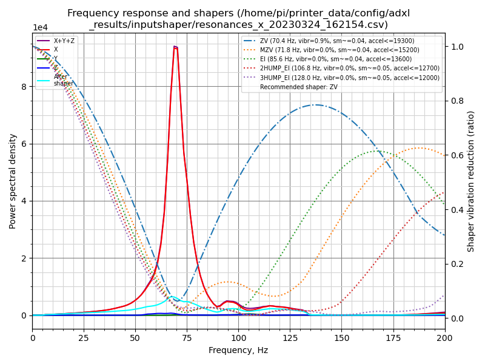

## Idee und Anleitung von Frix_x#0161 (https://github.com/Frix-x) Übersetzt von Fragmon#2722 

# Achsenmessungen

Bevor du beginnst, stellen sicher, dass die Riemen ordnungsgemäß gespannt sind und dass du bereits gute und klare Riemenverläufe hast (siehe [Riemenspannung](./Anleitung_Riemen.md)). (CORE XY only)

Das Makro `AXES_SHAPER_CALIBRATION` wird verwendet, um das Verhalten der Achsen zu messen und darzustellen, um Klippers Eingangsformungssystem einzustellen.

## Verwendung

Rufen Sie dann das Makro `AXES_SHAPER_CALIBRATION` auf und suchen Sie nach den Diagrammen im Ergebnisordner. Hier sind die verfügbaren Parameter:

| Parameter | Standardwert | Beschreibung |
|-----------:|---------------|-------------|
| VERBOSE | 1 | Ob in der Konsole Protokolliert werden soll |
| FREQ_START | 5 | Anfangsfrequenz der Anregung |
| FREQ_END | 133 | Maximale Anregungsfrequenz |
| HZ_PER_SEC | 1 | Anzahl der Hz pro Sekunde für den Test |
| AXIS | "all" | Achse, die Sie im "all"-Liste, "X" oder "Y" testen möchten |

## Beschreibung der Diagramme


### Übersetzung der Grafik

Im Titel repräsentiert ωo die primäre Resonanzfrequenz und ζ ist das geschätzte Dämpfungsverhältnis für die getestete Achse. Diese Werte sind nur genau, wenn das Diagramm eine klare Form mit einem gut erkennbaren Hauptgipfel zeigt.

Das erste Diagramm ist eine modifizierte Version des ursprünglichen Klipper Eingangsformers-Diagramms, jetzt mit zusätzlicher automatischer Spitzenentdeckung. Alles andere bleibt gleich.

Die Legende zeigt die verschiedenen geschätzten Leistungen des Formers für diese Achse, die Ihnen helfen, den besten für Sie auszuwählen. Es gibt auch einige Former-Empfehlungen basierend auf Leistung oder Vibrationsreduktionsziel, zusammen mit dem geschätzten Dämpfungsverhältnis. Für die Interpretation der Legende ziehen Sie bitte die folgende Dokumentation zurate.

Die Entspannungszone ist der grüne Bereich, in dem Gipfel nicht viel ausmachen. Sie können hier kleine Unebenheiten normalerweise ignorieren. Die gelbe Warnzone ist der Bereich, in dem Gipfel je nach ihrer Form besorgniserregend sein könnten. Alles über diesen Zonen sollte genau untersucht und angesprochen werden.

Das Zeit-Frequenz-Spektrogramm veranschaulicht die Reaktion der Achse über die Zeit während des Tests. Wichtige Elemente, die zu beachten sind:
- Diagonale Linien repräsentieren normalerweise die Hauptresonanzen, mit hellen Flecken, die hohe Amplitudenspitzen anzeigen, die mit Spitzen auf dem Hauptdiagramm übereinstimmen.
- Vertikale Linien resultieren aus konstanter Frequenzgeräusche, die häufig von Motorsteuerung oder möglicherweise externen Faktoren wie einem unausgeglichenen Lüfter stammen. Diese können auch später mit dem Schwingungsmessungs-Makro analysiert werden.
- Horizontale Linien, die nicht vorhanden sein sollten, könnten auf eine externe Störung mit der Maschine wie einen Stoß während des Tests hindeuten.
- Helle Flecken könnten auf eine periodische störende Schwingungsfrequenz wie eine Schraube oder etwas Ähnliches hindeuten, aber es ist ziemlich ungewöhnlich, so etwas zu sehen.

Das Bild bietet einen detaillierten Einblick in die Analyse von Maschinenschwingungen und ist ein nützliches Werkzeug für diejenigen, die mit der Feinabstimmung von Bewegungssystemen arbeiten.

## Analyse der Ergebnisse

### Allgemeines

Um Eingangsformungsdiagramme effektiv zu analysieren, gibt es keine universelle Methode, da verschiedene Faktoren die Leistung des 3D-Druckers oder die Messungen der Eingangsformung beeinflussen können. Hier sind jedoch einige Hinweise zum Lesen der Diagramme:

- Ein Diagramm mit einem **einzigen und schmalen Peak**, der gut vom Hintergrundrauschen abgesetzt ist, ist ideal, da es leicht von der Eingangsformung gefiltert werden kann. Aber je nach Maschine und ihrer mechanischen Konfiguration ist es nicht immer möglich, diese Form zu erhalten. Der Schlüssel zu besseren Diagrammen liegt in einer sauberen mechanischen Montage mit einem besonderen Augenmerk auf der Steifigkeit und Festigkeit von allem, angefangen beim Tisch, auf dem der Drucker steht, bis hin zum Rahmen und dem Werkzeugkopf.

- Bei den Riemenkurven sollten Sie sich **auf die Form der Kurven, nicht auf die Werte** konzentrieren. Der Energiewert liefert nicht viele nützliche Informationen. Verwenden Sie ihn nur, um zwei Ihrer eigenen Diagramme zu vergleichen und den Einfluss Ihrer mechanischen Änderungen zwischen zwei aufeinanderfolgenden Tests zu messen, aber verwenden Sie ihn niemals, um Diagramme von anderen Personen oder anderen Maschinen zu vergleichen.


Verlassen Sie sich bei der Einstellung Ihrer Eingangsformungsfilter auf die automatisch berechneten Werte, die oben rechts im Diagramm angezeigt werden. Hier ist eine Aufschlüsselung der Legende für ein besseres Verständnis:

- **Filteralgorithmen**: Klipper berechnet diese Linien automatisch. Diese Berechnung funktioniert ziemlich gut, wenn die Diagramme sauber genug sind. Wenn Ihre Diagramme jedoch von minderer Qualität sind, kann sie keine Wunder vollbringen und Ihnen ziemlich schlechte Empfehlungen geben. Es ist besser, zuerst die mechanischen Probleme zu beheben. Jeder Shaper hat seine Vor- und Nachteile:

    - `ZV` ist ein ziemlich leichter Filter und hat normalerweise noch einige verbleibende Vibrationen. Meine Empfehlung wäre, ihn nur zu verwenden, wenn Sie Geschwindigkeitsbenchies machen möchten und die höchsten Beschleunigungswerte erreichen möchten, während Sie die Glättung Ihrer Teile gering halten möchten. Wenn Sie "perfekte" Diagramme haben und nicht so sehr auf verbleibendes Nachklingen achten, können Sie es versuchen.
    
    - `MZV` ist normalerweise die bevorzugte Wahl für gut eingestellte Maschinen. Es ist ein guter Kompromiss zwischen geringen verbleibenden Vibrationen und ziemlich guten Beschleunigungswerten. Beachten Sie jedoch, dass `MZV` von Klipper nur bei guten Diagrammen empfohlen wird.
    
    - `EI` kann als Ausweichlösung für problematische Diagramme verwendet werden. Versuchen Sie jedoch zunächst, Ihre mechanischen Probleme zu beheben: Fast jeder Drucker sollte stattdessen `MZV` verwenden können.
    
    - `2HUMP_EI` und `3HUMP_EI` sind letzte Ausweichmöglichkeiten. Normalerweise führen sie zu einer hohen Glättung, um das Nachklingen zu unterdrücken, und verwenden gleichzeitig relativ niedrige Beschleunigungswerte. Wenn sie als Vorschläge auftauchen, hat Ihre Maschine wahrscheinlich zugrunde liegende mechanische Probleme (die zu ziemlich schlechten oder "breiten" Diagrammen führen).

- **Empfohlene Beschleunigung** (`accel<=...`): Dies ist keine eigenständige Zahl. Es ist wichtig, auch die Werte `vibr` und `sm` zu berücksichtigen, da es ein Kompromiss zwischen den dreien ist. Sie geben Ihnen den Prozentsatz der verbleibenden Vibrationen und die Glättung nach der Eingangsformung an, wenn die empfohlene Beschleunigung verwendet wird. Nichts hindert Sie daran, höhere Beschleunigungswerte zu verwenden; sie sind keine Grenze. Bei Verwendung hoher Beschleunigungswerte kann die Eingangsformung jedoch nicht in der Lage sein, das Nachklingen auf Ihren Teilen vollständig zu unterdrücken. Schließlich sollten Sie bedenken, dass hohe Beschleunigungswerte überhaupt nicht nützlich sind, wenn immer noch eine hohe Menge verbleibender Vibrationen vorhanden ist: Sie sollten zuerst etwaige mechanische Probleme angehen.

- **Verbleibende Vibrationen** (`vibr`): Dies korreliert direkt mit dem Nachklingen. Es entspricht dem Gesamtwert des blauen "nach Shaper" Signals. Idealerweise möchten Sie einen Filter mit minimalen oder keinen Vibrationen.

- **Shaper-Empfehlungen**: Dieses Skript gibt Ihnen maßgeschneiderte Empfehlungen basierend auf Ihren Diagrammen. Wählen Sie denjenigen aus, der Ihren Anforderungen entspricht:

    - Der "Performance"-Shaper ist Klippers ursprüngliche Empfehlung, die sich gut für hohe Beschleunigungen eignet und manchmal auch g

eringfügige verbleibende Vibrationen zulässt. Verwenden Sie ihn, wenn Ihr Ziel schnelles Drucken ist und Ihnen geringfügiges Nachklingen nicht viel ausmacht.
    
    - Der "Low Vibration"-Shaper zielt auf das geringste Maß an verbleibenden Vibrationen ab, um die beste Druckqualität mit minimalem Nachklingen zu gewährleisten. Dies sollte die beste Wahl für die meisten Benutzer sein.
    
    - Manchmal wird nur eine einzige Empfehlung namens "Bester" Shaper präsentiert. Dies bedeutet entweder, dass kein geeigneter "Low Vibration"-Shaper gefunden wurde (aufgrund hoher Vibrationen oder zu hoher Glättung) oder dass der "Performance"-Shaper auch derjenige mit dem geringsten Vibrationsniveau ist.

- **Dämpfungsverhältnis**: Am Ende angezeigt, ist diese Schätzung nur zuverlässig, wenn das Diagramm einen klaren, eigenständigen und sauberen Peak zeigt. Bei einer gut abgestimmten Maschine kann das Einstellen des Dämpfungsverhältnisses (anstelle des Standardwerts von Klipper 0,1) das Nachklingen bei hohen Beschleunigungen und höheren Eckgeschwindigkeiten weiter reduzieren.

Fügen Sie dann Ihrer Konfiguration hinzu:

```
[input_shaper]
shaper_freq_x: ... # Mittenfrequenz für den X-Achsen-Filter
shaper_type_x: ... # Filtertyp für die X-Achse
shaper_freq_y: ... # Mittenfrequenz für den Y-Achsen-Filter
shaper_type_y: ... # Filtertyp für die Y-Achse
damping_ratio_x: ... # Dämpfungsverhältnis für die X-Achse
damping_ratio_y: ... # Dämpfungsverhältnis für die Y-Achse
```

### Nützliche Fakten und Mythenentlarvung

Einige Leute schlagen vor, Daten bei 100 Hz zu begrenzen, indem sie die .csv-Datei manuell bearbeiten, und denken, dass Werte darüber falsch sind. Dies kann jedoch irreführend sein. Die Anregungs- und die Frequenzen der Systemantwort unterscheiden sich und sind nicht direkt miteinander verknüpft. Sie könnten Vibrationen jenseits des Anregungsbereichs sehen, und sie aus der Datei zu entfernen, verbirgt potenzielle Probleme. Obwohl diese Hochfrequenzvibrationen die Druckqualität nicht immer beeinträchtigen, könnten sie auf mechanische Probleme hinweisen. Statt sie zu verbergen, sollten Sie versuchen, diese Probleme zu lösen.

Was die Druckerkomponenten betrifft, empfehle ich nicht, einen extra leichten X-Träger (Aluminium oder Kohlefaser) zu verwenden. Sie mögen aufgrund ihres Gewichts ideal erscheinen, aber es gibt mehr zu beachten als nur die Masse, wie die Steifigkeit (siehe [die Theorie dahinter](./Hintergrund_Input_Shaper.md)). Diese leichten Träger können flexibler sein und sich negativ auf die Y-Achsen-Diagramme auswirken, da sie sich unter hoher Beschleunigung biegen können.

Schließlich sollten Sie bedenken, dass jede Achse ihre eigenen Eigenschaften wie Masse und Geometrie hat, die zu unterschiedlichem Verhalten führen und unterschiedliche Filter erfordern. Die Verwendung der gleichen Eingangsformungseinstellungen für beide Achsen ist nur dann gültig, wenn beide Achsen mechanisch ähnlich sind. Dies kann auf einige Maschinen zutreffen, hauptsächlich auf Kreuz-Gantry-Konfigurationen wie [CroXY](https://github.com/CroXY3D/CroXY) oder [Annex-Engineering](https://github.com/Annex-Engineering)-Druckern, aber nicht auf anderen. 

## Beispiele für Diagramme

In diesem Abschnitt werde ich einige zufällige Diagramme vorstellen, die online gefunden oder mir zur Analyse zur Verfügung gestellt wurden. Mein Ziel ist es, das Gute und das weniger Gute hervorzuheben und Einblicke zu bieten, um Ihre Eingangsformungseinstellungen zu optimieren.

Dennoch ist die Interpretation von Eingangsformungsdiagrammen keine exakte Wissenschaft. Obwohl wir fundierte Vermutungen anstellen und potenzielle Probleme anhand dieser Diagramme aufzeigen können, ist das genaue Feststellen der Ursachen nicht immer möglich. Betrachten Sie daher die kommenden Diagramme und ihre Kommentare als Wegweiser auf Ihrer Reise zur Eingangsformung, anstatt als absolute Wahrheiten.

### Gute Diagramme

Diese beiden Diagramme gelten als gut und sind das, was Sie anstreben sollten. Sie zeigen jeweils einen einzelnen, deutlichen Peak, der klar vom Hintergrundrauschen abhebt. Beachten Sie, dass die Hauptfrequenzen der X- und Y-Diagrammpeaks unterschiedlich sind. Diese Variation ist zu erwarten und normal, wie im letzten Punkt der [nützlichen Fakten und Mythenentlarvung](#nützliche-fakten-und-mythenentlarvung) erläutert.

| Gutes X-Diagramm | Gutes Y-Diagramm |
| --- | --- |
|  |  |

### Niedrige Frequenzenergie

Diese Diagramme weisen eine niedrige Frequenzenergie (Signal nahe 0 Hz) bei relativ geringer maximaler Amplitude (etwa 1e2 oder 1e3) auf. Dies bedeutet, dass es während der Bewegungen zu Bindungen, Reibungen oder Schleifen kommt: im Grunde genommen bewegt sich etwas nicht frei. Geringe niedrige Frequenzenergie in den Diagrammen kann auf verschiedene Probleme hinweisen, wie eine fehlerhafte Umlenkrolle/Lager oder eine zu stark angezogene Schlitten-Schraube, die das freie Bewegen auf der Linearschiene verhindert, ... Größere niedrige Frequenzenergie weist auf schwerwiegendere Probleme hin, wie eine falsche Riemenführung (am häufigsten) oder einen defekten Motor, ...

Hier sind einige Schritte zur Fehlerbehebung:

1. **Untersuchung der Riemen**:
   - Stelle sicher, dass deine Riemen ordnungsgemäß verlegt sind.
   - Überprüfe während der Bewegung die korrekte Ausrichtung der Riemen an allen Lagerflanschen (überprüfe sie während eines Drucks).
   - Riemenstaub ist oft ein Zeichen für Fehlausrichtung oder Verschleiß.

2. **Verhalten des Werkzeugkopfs bei CoreXY-Druckern**: Mit ausgeschalteten Motoren und dem Werkzeugkopf in der Mitte schiebe den Y-Achse sanft vor und zurück. Der Werkzeugkopf sollte sich nicht nach links oder rechts bewegen. Wenn er es tut, könnte einer der Riemen blockiert sein und erfordert eine Inspektion, um das Problem herauszufinden.

3. **Rechteckigkeit der Gantry**:
   - Stelle sicher, dass deine Gantry perfekt parallel und rechtwinklig ist. Du kannst dich an [Nero3D's De-Racking-Video](https://youtu.be/cOn6u9kXvy0?si=ZCSdWU6br3Y9rGsy) wenden, um Anleitungen zu erhalten.
   - Nach dem Entfernen der Riemen teste die Bewegung des Werkzeugkopfs von Hand an allen Positionen. Die Bewegung sollte reibungslos und ohne harte Punkte oder Bereiche mit Widerstand verlaufen.

Wenn du Probleme mit der Riemenverlegung oder der Ausrichtung der Riemen feststellst, solltest du diese zuerst angehen. Wenn das Problem weiterhin besteht und sich als doppelte Spitzen oder breite Spitzen in den Graphen manifestiert, könnten andere Faktoren eine Rolle spielen:

1. Ein wackeliger Tisch kann die Ursache sein. Versuche zuerst, den Drucker direkt auf den Boden zu stellen.

2. Stelle sicher, dass die Riemen optimal gespannt sind, indem du das Makro BELTS_SHAPER_CALIBRATION (siehe [Riemenspannung](./Anleitung_Riemen.md)) verwendest.

3. Wenn die Probleme weiterhin bestehen, könnte es an einer unsachgemäß ausgerichteten Gantry liegen. Zur Korrektur kannst du dich an [Nero3D's De-Racking-Video](https://youtu.be/cOn6u9kXvy0?si=ZCSdWU6br3Y9rGsy) wenden.

4. Wenn das Problem weiterhin besteht, musst du herausfinden, was schwingt, um es zu beheben. Du kannst das Makro `EXCITATE_AXIS_AT_FREQ` verwenden, um dir bei der Suche zu helfen.

Die Grafiken in den Abbildungen zeigen Beispiele für diese Probleme und können dir bei der Identifizierung und Lösung der Ursachen helfen.
