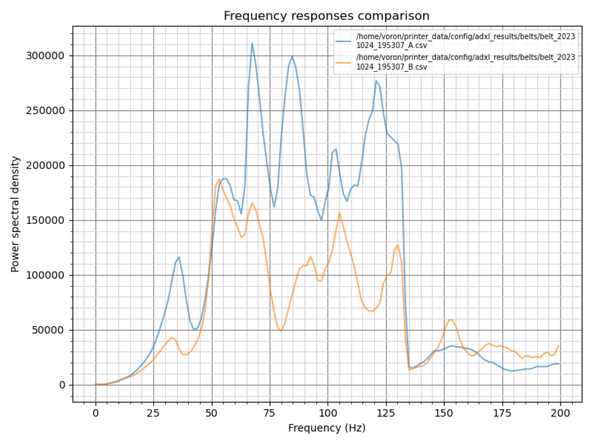

## Idee und Anleitung von Frix_x#0161 (https://github.com/Frix-x)
## Übersetzt von Fragmon#2722 

# Messungen der relativen Riemenunterschiede

Das Makro `BELTS_SHAPER_CALIBRATION` ist speziell für CoreXY-Maschinen gedacht, wo es dir helfen kann, Probleme mit dem Riemenverlauf zu diagnostizieren, indem es die Unterschiede in ihrem Verhalten misst und aufzeichnet. Es wird dir auch helfen, deine Riemen mit der gleichen Spannung zu spannen.

## Nutzung

**Vor dem Start, stelle sicher, dass die Riemen richtig gespannt sind**. Zum Beispiel kannst du der [Voron-Dokumentation zur Riemen-Spannung](https://docs.vorondesign.com/tuning/secondary_printer_tuning.html#belt-tension) folgen. Das ist entscheidend: Du brauchst einen guten Ausgangspunkt, von dem aus du dann iterieren kannst!

Rufe dann das Makro `BELTS_SHAPER_CALIBRATION` auf und suche nach den Grafiken im Ergebnisordner. Hier sind die verfügbaren Parameter:

| Parameter | Standardwert | Beschreibung |
|-----------:|---------------|-------------|
|VERBOSE|1|Ob etwas in der Konsole protokolliert werden soll|
|FREQ_START|5|Startfrequenz der Anregung|
|FREQ_END|133|Maximale Anregungsfrequenz|
|HZ_PER_SEC|1|Anzahl der Hz pro Sekunde für den Test|

## Beschreibung der Grafiken

## Analyse der Ergebnisse

Bei diesen Grafiken **möchtest du, dass beide Kurven ähnlich aussehen und sich überlappen, um eine einzelne Kurve zu bilden**: Versuche, sie so eng wie möglich in Frequenz **und** Amplitude aneinander anzupassen. Normalerweise besteht ein Riemen-Diagramm aus einem oder zwei Hauptpeaks (mehr als zwei Peaks können auf mechanische Probleme hindeuten). "Rauschen" um die Hauptpeaks ist akzeptabel, sollte aber bei beiden Kurven mit vergleichbarer Amplitude vorhanden sein. Behalte im Kopf, dass wenn du einen Riemen spannst, seine Peaks sich diagonal zur oberen rechten Ecke bewegen sollten, sich signifikant in der Amplitude und leicht in der Frequenz verändern. Zusätzlich sollte die Größenordnung der Hauptpeaks *typischerweise* bei den meisten Maschinen von ~500k bis ~2M reichen.

Abgesehen von der eigentlichen Riemen-Spannung hängt die Resonanzfrequenz/amplitude der Kurven hauptsächlich von drei Parametern ab:
  - die *Masse des Werkzeugkopfes*, die bei CoreXY-, CrossXY- und H-Bot-Maschinen für beide Riemen identisch ist. Daher wird dies hier wahrscheinlich keinen Effekt haben.
  - die *Elastizität des Riemens*, die sich mit der Zeit ändert, da der Riemen abgenutzt wird. Stelle sicher, dass du die **gleiche Riemenmarke und -art** für die A- und B-Riemen verwendest und dass sie **gleichzeitig installiert wurden**: Du möchtest ähnliche Riemen mit einem ähnlichen Abnutzungsgrad!
  - die *Länge des Riemenverlaufs*, weshalb sie die **exakt gleiche Anzahl an Zähnen** haben müssen, damit ein Riemenverlauf nicht länger als der andere ist, wenn sie mit der gleichen Spannung gespannt werden. Dieser spezifische Punkt ist sehr wichtig: Ein einziger Zahn Unterschied reicht aus, um dich von einer guten Überlappung der Kurven abzuhalten. Zudem ist es sogar eine der Hauptursachen für Probleme, die in Discord-Resonanztest-Kanälen gefunden wurden.

**Wenn diese drei Parameter erfüllt sind, kann es nicht sein, dass die Kurven unterschiedlich sind** oder du kannst sicher sein, dass es ein zugrundeliegendes Problem in mindestens einem der Riemenverläufe gibt. Auch, wenn die Riemen-Diagramme Kurven mit niedriger Amplitude (keine ausgeprägten Peaks) und viel Rauschen haben, wirst du wahrscheinlich auch schlechte Input-Shaper-Grafiken haben. Also, bevor du weitermachst, stelle sicher, dass du gute Riemen-Diagramme hast oder behebe deine Riemenverläufe. Beginne mit der Überprüfung der Riemen-Spannung, Lager, Portal-Schrauben, Ausrichtung der

 Riemen auf den Umlenkrollen usw.

## Erweiterte Erklärung, warum 1 oder 2 Peaks

Das Riemen-Diagramm wird erstellt, indem diagonale Bewegungen durchgeführt werden, die darauf ausgelegt sind, das System mit nur einem Motor gleichzeitig anzuregen. Ziel ist es, das Verhalten jedes Riemens zu bewerten, um sie zu vergleichen, aber das ist nicht so einfach aufgrund einiger Faktoren:
  1. Diagonale Bewegungen können in zwei verschiedene Untersysteme aufgeteilt werden: Der Werkzeugkopf bewegt sich von links nach rechts entlang der linearen X-Achse und die Bewegung des Werkzeugkopfes und der linearen X-Achse von vorne nach hinten. Im Wesentlichen beobachten wir anstatt eines einzelnen harmonischen Systems zwei miteinander verflochtene Untersysteme in Bewegung. Diese Komplexität kann zu zwei Resonanzfrequenzen (oder Peaks) im Riemen-Diagramm führen. Aber da beide Untersysteme ähnliche Riemen, Spannung usw. verwenden... können diese Peaks manchmal verschmelzen und als einer erscheinen.
  2. Der Werkzeugkopf ist kontinuierlich mit den beiden Riemen verbunden. Wenn eine diagonale Bewegung durchgeführt wird, um nur einen Riemen anzuregen, bleibt der andere Riemen statisch und dient als Anker. Aber aufgrund seiner Elastizität bleibt dieser Riemen nicht starr. Er überträgt seine einzigartigen Eigenschaften auf die Gesamtantwort des Systems, was zusätzliches Rauschen oder sogar einen zweiten Peak einführen kann.

## Beispiele für Diagramme

### Gute Diagramme

Die folgenden Diagramme werden als gut betrachtet. Beide haben nur einen oder zwei Peaks, und sie überlappen sich ziemlich gut, um eine einzige Kurve zu bilden. Wenn du so etwas bekommst, kannst du mit den [Achsen-Input-Shaper-Diagrammen](./Anleitung_Inputshaper.md) weitermachen.

| Mit nur einem Peak | Mit zwei Peaks |
| --- | --- |
|  |  |

### Falsche Riemen-Spannung

Die folgenden Diagramme zeigen die Auswirkungen einer falschen oder ungleichmäßigen Riemen-Spannung. Denke daran, dass wenn du große Anpassungen vornehmen musst, immer **deine Riemen-Spannung zwischen jedem Schritt überprüfen und nur kleine Anpassungen vornehmen** solltest, um deine Maschine nicht durch Überstraffung der Riemen zu beschädigen!

| Kommentar | Beispiel |
| --- | --- |
| Die Spannung des A-Riemens ist etwas geringer als die des B-Riemens. Dies kann schnell behoben werden, indem die Schraube nur etwa eine halbe bis eine ganze Umdrehung angezogen wird. |  |
| Die Spannung des B-Riemens ist deutlich geringer als die des A-Riemens. Wenn du auf dieses Diagramm stößt, empfehle ich, zur [Voron-Dokumentation zur Riemen-Spannung](https://docs.vorondesign.com/tuning/secondary_printer_tuning.html#belt-tension) zurückzukehren, um eine solidere Basis zu haben. Du könntest jedoch die B-Spannung leicht erhöhen und die A-Spannung verringern, aber sei vorsichtig, um nicht von der empfohlenen 110Hz-Basis abzuweichen. |  |

### Problem mit dem Riemenverlauf

Wenn es ein Problem innerhalb des Riemenverlaufs gibt, kann es unerreichbar sein, die Kurve auszurichten und zu überlagern, selbst mit korrekter Riemen-Spannung. Beginne damit, zu überprüfen, dass jeder Riemen **die exakt gleiche Anzahl an Zähnen** hat. Dann inspiziere die Riemenverläufe, Lager, jegliche Abnutzungszeichen (wie Riemenstaub) und stelle sicher, dass der Riemen während der Bewegung korrekt auf allen Lagerflanschen ausgerichtet ist.

| Kommentar | Beispiel |
| --- | --- |
| Auf diesem Diagramm gibt es zwei Peaks. Das erste Paar der

 Peaks scheint fast ausgerichtet zu sein, aber der zweite Peak erscheint nur auf dem B-Riemen, deutlich abweichend vom A-Riemen. Dies deutet auf ein Problem mit dem Riemenverlauf hin, wahrscheinlich mit dem B-Riemen. |  |
| Dieses Diagramm ist ziemlich komplex und zeigt 3 Peaks. Obwohl alle Paare gut ausgerichtet zu sein scheinen und die Spannung in Ordnung ist, gibt es mehr als nur zwei Gesamtpeaks, weil `[1]` in zwei kleinere Peaks aufgeteilt ist. Das könnte ein Problem sein, aber es ist nicht sicher. Es wird empfohlen, die [Achsen-Input-Shaper-Diagramme](./Anleitung_Inputshaper.md) zu generieren, um deren Auswirkungen zu bestimmen. |  |
| Dieses Diagramm könnte zu niedrige Riemen-Spannung anzeigen, aber auch potenzielle Bindungen, Reibung oder etwas, das die reibungslose Bewegung des Werkzeugkopfes behindert. Tatsächlich ist die Signalstärke beträchtlich niedrig (mit einem Peak um 300k, verglichen mit dem typischen ~1M) und hauptsächlich mit Rauschen gefüllt. Beginne damit, [hier](https://docs.vorondesign.com/tuning/secondary_printer_tuning.html#belt-tension) zurückzukehren, um eine robuste Spannungsbasis zu etablieren. Erzeuge anschließend die [Achsen-Input-Shaper-Diagramme](./axis_tuning.md), um jegliche Bindungen zu identifizieren und das Problem zu beheben. |  |
