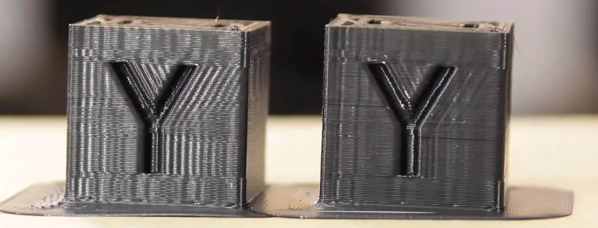

# Eingabeformung und Abstimmungsgrundlagen

Da immer mehr Menschen diese Makros verwenden, entstehen Fragen zur Interpretation der Ergebnisse oder zur richtigen Abstimmung bzw. Behebung mechanischer Verhaltensweisen einer Maschine. Dieses Dokument bietet dir Anleitungen zur Interpretation. Beachte, dass es keine universelle Methode gibt: Verschiedene Personen können die Ergebnisse unterschiedlich interpretieren oder andere Meinungen haben. Es ist wichtig, dass du experimentierst und herausfindest, was für deinen eigenen 3D-Drucker am besten funktioniert.

## Verständnis von Schwingungen

Wenn sich ein 3D-Drucker bewegt, wenden die Motoren Kraft an, um den Druckkopf entlang eines präzisen Pfads zu bewegen. Diese Kraft wird von der Motorwelle über das gesamte Bewegungssystem des Druckers auf den Druckkopf übertragen. Wenn der Druckkopf eine scharfe Ecke erreicht und die Richtung ändern muss, möchte seine Trägheit ihn dazu bringen, sich weiter in einer geraden Linie zu bewegen. Die Motoren zwingen den Druckkopf zur Wende, aber die Riemen wirken wie Federn und erlauben dem Druckkopf, in die senkrechte Richtung zu schwingen. Diese Schwingungen erzeugen sichtbare Artefakte auf den gedruckten Teilen, bekannt als Schwingungen oder Geisterbilder.

## Grundlagen zu den Grafiken

Beachte beim Abstimmen des Input Shapers Folgendes:
  1. **Konzentriere dich auf die Form der Grafiken, nicht auf die genauen Zahlen**. Es kann Unterschiede zwischen ADXL-Boards oder sogar Druckern geben, also gibt es keinen spezifischen "Zielwert". Das bedeutet, dass du nicht erwarten solltest, zwischen verschiedenen Druckern dieselben Grafiken zu erhalten, selbst wenn sie in Bezug auf Marke, Teile, Größe und Montage ähnlich sind.
  1. Kleine Unterschiede zwischen aufeinanderfolgenden Testläufen sind normal, da die ADXL-Qualität und -Empfindlichkeit zwischen den Boards recht variabel sind.
  1. Führe die Tests durch, wenn die Maschine aufgeheizt und nahe den Druckbedingungen ist, da die Temperatur die Maschinenkomponenten wie Riemenspannung oder sogar das Rahmenwerk, das bekanntermaßen ein wenig expandiert, beeinflussen wird.
  1. Vermeide es, die Lüfter des Druckkopfs während der Tests laufen zu lassen, da sie unnötige Geräusche in die Grafiken einbringen und diese schwerer zu interpretieren machen. Das bedeutet, dass du, auch wenn du den Drucker aufheizen solltest, davon absehen solltest, den Heizblock-Heizer während des Tests zu aktivieren, da er auch den Heizblock-Lüfter auslösen wird. Allerdings, da ein schlechter Lüfter normalerweise einige Vibrationen verursacht, kannst du den Test nutzen, um einen unausgewogenen Lüfter zu diagnostizieren, wie im Abschnitt [Beispiele für Input Shaper Grafiken](./macros/axis_tuning.md) zu sehen ist.
  1. Stelle die Genauigkeit deiner ADXL-Messungen sicher, indem du einen `MEASURE_AXES_NOISE`-Test durchführst und überprüfst, dass das Ergebnis für alle Achsen unter 100 liegt. Wenn dies nicht der Fall ist, überprüfe dein ADXL-Board und die Verkabelung, bevor du fortfährst.
  1. Die Grafiken können nur Symptome möglicher Probleme aufzeigen und das auf unterschiedliche Weisen. Diese Symptome können manchmal Ursachen vorschlagen, aber sie selten genau auf die Probleme hinweisen. Zum Beispiel könntest du diagnostizieren, dass einige Schrauben nicht richtig festgezogen sind, aber es ist unwahrscheinlich, dass du mit diesen Tests genau herausfindest, welche Schraube problematisch ist. Du wirst meistens tüfteln und experimentieren müssen.
  1. Zum Schluss, denke daran, warum du diese Tests durchführst: um saubere Drucke zu erhalten. Werde nicht zu besessen von perfekten Grafiken, da die letzten Optimierungsschritte wahrscheinlich den geringsten Einfluss auf die ged

ruckten Teile in Bezug auf Schwingungen und Geisterbilder haben.
