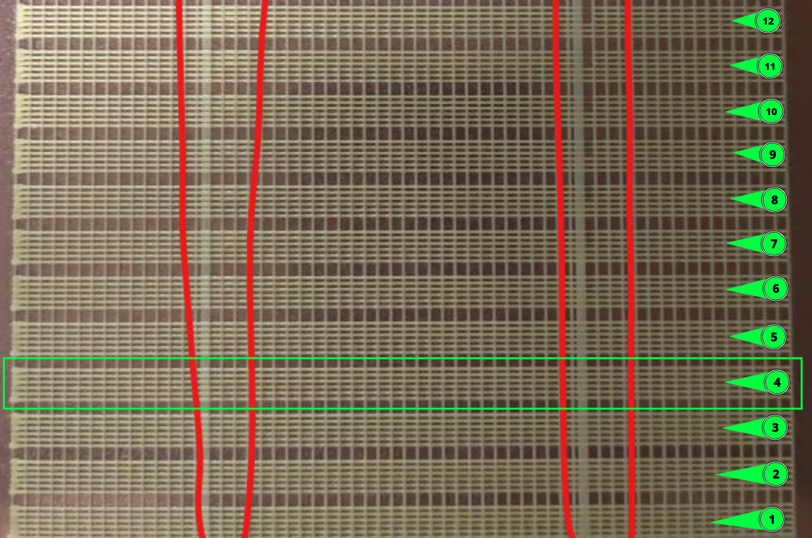

## Idee und Anleitung von Frix_x#0161 (https://github.com/Frix-x) Übersetzt von Fragmon#2722 

## Beschreibung

Dieses Makro druckt eine Reihe von ¨Bändern¨, die jeweils 6 Zeilen enthalten, wobei die ersten 3 Zeilen langsam gedruckt und als Grundlinie/Kontrolle verwendet werden und die anderen 3 mit variablen Geschwindigkeiten in der folgenden Reihenfolge: 25% der Zeile mit niedriger Geschwindigkeit, dann 50% mit hoher Geschwindigkeit und die letzten 25% wieder mit niedriger Geschwindigkeit. Dann wird der Druckvorlaufwert für jedes Band erhöht.


Das gedruckte Modell kann dann anhand der obersten und untersten Zeile in jedem Band überprüft werden: Artefakte des Druckvorschubs sind dort zu sehen, wo sich die Druckgeschwindigkeiten in jeder Zeile ändern. Sie müssen nur das höchste Band von unten finden, bei dem die oberen Linien noch ähnlich aussehen wie die unteren, ohne sichtbare Unregelmäßigkeiten in der Extrusionsbreite oder Druckvorschubartefakte.


## Verwendung

Vergewissern Sie sich zunächst, dass die Achsen ausgerichtet sind und das Bedmesh geladen ist (falls Sie eines verwenden), Vergessen Sie nicht, QGL, Z-Tilt, Z-Offset richtig einzustellen, ... Im Grunde können Sie Ihren `PRINT_START` manuell aufrufen oder alle erforderlichen Schritte wiederholen.

Die Parameter, die beim Aufruf des Makros `PRESSURE_ADVANCE_CALIBRATION` zur Verfügung stehen, entnehmen Sie bitte dieser Tabelle:

| Parameter | Standardwert | Beschreibung |
|-----------:|---------------|-------------|
|EXTRUDER_TEMP|245|         Drucktemperatur
|BED_TEMP|1|                Druckbetttemperatur
|DO_RAFT|1|druckt eine "Basis", um das Testgitter zu stützen (bessere Haftung des Bettes und leichtere Entfernung am Ende)|
|START|0.02|PA-Wert zum Starten|
|INCREMENT|0.005|PA-Wert, der für jedes folgende Band erhöht wird|
|EXTRUSION_MULTIPLIER|1.25 wenn Raft aktiviert, 1.5 wenn deaktiviert|Extrusionsmultiplikator, der auf die Druckzeilen im Band angewendet wird|
|PRINT_SIZE|120|maximale Breite/Höhe, in mm, die der Test nutzen kann. Das Modell wird in der Mitte des Bettes gedruckt.
|BANDS_LIMIT|999|optional kann die Anzahl der Bänder auf diese Weise begrenzt werden. Ansonsten werden so viele Bänder gedruckt, wie in die angegebene GRÖSSE passen.
|LINES_PER_BAND|6|Anzahl der Zeilen pro Band. Die Hälfte davon sind Kontrollzeilen, die andere Hälfte sind Testzeilen.
|LINE_SPACING|0.4|Abstand zwischen den einzelnen Zeilen eines Bandes
|PURGE_MM|8|mm Filament, das vor dem Druckstart zum Druckstart geschoben wird (kann 0 sein, um zu deaktivieren)|
|RAFT_SPEED|80|Vorschubrate (in mm/s) für den Druck des Rafts|
|CONTROL_SPEED|30|Vorschubgeschwindigkeit (in mm/s) für den Druck der "Kontroll"-Linien in einem Band
|OUTER_SPEED|40|Vorschub (in mm/s) für den Druck des äußeren Teils der "Test"-Zeilen in einem Band
|INNER_SPEED|80|Vorschubgeschwindigkeit (in mm/s) für den Druck des inneren Teils der "Test"-Zeilen in einem Band
|TRAVEL_SPEED|200|Vorschubgeschwindigkeit (in mm/s) für schnelle Verfahrbewegungen
|RETRACT_LENGTH|0.6|Rückzugslänge in mm (verwenden Sie Ihren eigenen Rückzugswert für das Filament)|

Zählen Sie dann die Anzahl der Bänder von der Unterseite des Drucks, bis die Kontrolllinien ähnlich wie die Testlinien aussehen. Achten Sie auf den roten Bereich, in dem sich die Geschwindigkeit während des Drucks ändert: Suchen Sie das Band, in dem es keine Ausbuchtung oder Lücke gibt, wie in der folgenden Abbildung:



Verwenden Sie dann die folgende Formel, um den neuen PA-Wert zu ermitteln:

```
NEW_PA = START + (INCREMENT * band_number)

