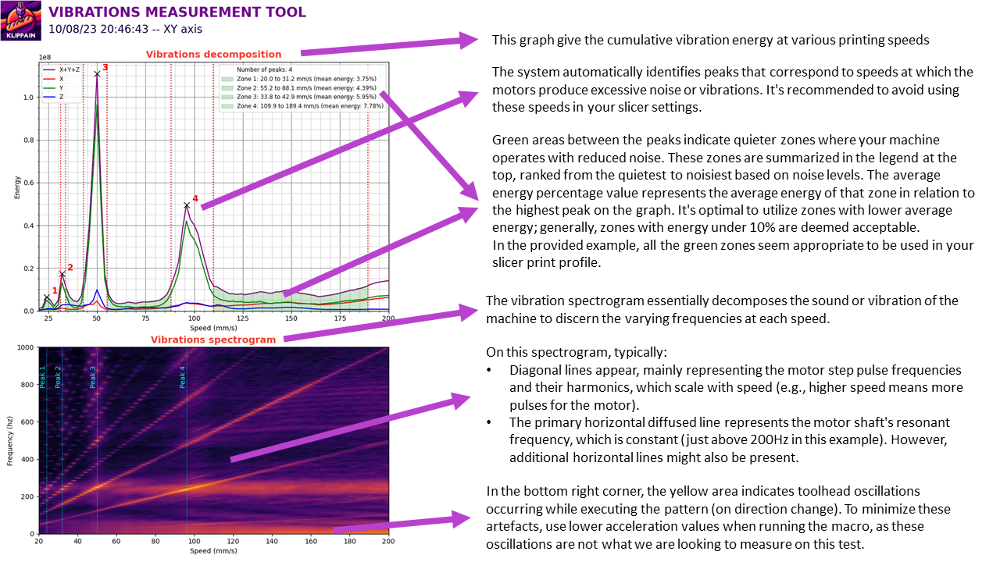

## Idee und Anleitung von Frix_x#0161 (https://github.com/Frix-x) Übersetzt von Fragmon#2722 
# Vibrationsmessungen

Das Makro `VIBRATIONS_CALIBRATION` hilft Ihnen dabei, die Geschwindigkeitseinstellungen zu identifizieren, die die Vibrationen der Maschine verschlimmern (d. h. wo das Gestell und die Motoren stark in Resonanz geraten). Dies wird Ihnen helfen, die sauberen Geschwindigkeitsbereiche zu finden, in denen die Maschine leiser ist und weniger anfällig für vertikale feine Artefakte in den Drucken.

  > **Warnung**
  >
  > Sie müssen zuerst den Standard-Input-Shaper-Algorithmus von Klipper mit den anderen Makros kalibrieren! Dieser Test sollte nicht vorher verwendet werden, da er nutzlos wäre und die Ergebnisse ungültig.

## Nutzung

Rufen Sie das Makro `VIBRATIONS_CALIBRATION` mit der Richtung und dem Geschwindigkeitsbereich auf, den Sie messen möchten. Hier sind die verfügbaren Parameter:

| Parameter | Standardwert | Beschreibung |
|-----------:|---------------|-------------|
|SIZE|60|Größe in mm des Bereichs, in dem die Bewegungen ausgeführt werden|
|DIRECTION|"XY"|Richtungsvektor, in dem Sie die Messungen durchführen möchten. Kann auf "XY", "AB", "ABXY", "A", "B", "X", "Y", "Z", "E" gesetzt werden|
|Z_HEIGHT|20|Z-Höhe, auf die der Werkzeugkopf vor Beginn der Bewegungen gestellt wird. Seien Sie vorsichtig, wenn Ihr ADXL unter der Düse ist, erhöhen Sie ihn, um einen Aufprall des ADXL auf das Bett der Maschine zu vermeiden|
|VERBOSE|1|Ob die aktuelle Geschwindigkeit in der Konsole protokolliert werden soll|
|MIN_SPEED|20|minimale Geschwindigkeit des Werkzeugkopfes in mm/s für die Bewegungen|
|MAX_SPEED|200|maximale Geschwindigkeit des Werkzeugkopfes in mm/s für die Bewegungen|
|SPEED_INCREMENT|2|Geschwindigkeitssteigerungen des Werkzeugkopfes in mm/s zwischen jeder Bewegung|
|TRAVEL_SPEED|200|Geschwindigkeit in mm/s, die für alle Reisebewegungen verwendet wird|
|ACCEL_CHIP|"adxl345"|Name des Beschleunigungssensorchips in der Konfiguration|

## Beschreibung der Diagramme



### Übersetzung der Grafik

Das Diagramm zeigt die kumulative Vibrationsenergie bei verschiedenen Druckgeschwindigkeiten

Das System identifiziert automatisch Spitzen, die Geschwindigkeiten entsprechen, bei denen die Motoren übermäßigen Lärm oder Vibrationen erzeugen. Es wird empfohlen, diese Geschwindigkeiten in Ihren Slicer-Einstellungen zu vermeiden.

Die grünen Bereiche zwischen den Spitzen zeigen ruhigere Zonen an, in denen Ihre Maschine mit reduziertem Lärm arbeitet. Diese Zonen sind in der Legende oben nach ihrer Ruhe, basierend auf den Geräuschpegeln, eingestuft. Der durchschnittliche Energieprozentsatz gibt die durchschnittliche Energie dieser Zone im Verhältnis zur höchsten Spitze auf dem Diagramm an. Es ist optimal, Zonen mit niedrigerer durchschnittlicher Energie zu nutzen; generell werden Zonen mit einer Energie unter 10% als akzeptabel erachtet. Im vorliegenden Beispiel scheinen alle grünen Zonen geeignet, in Ihrem Slicer-Druckprofil verwendet zu werden.

Das Vibrations-Spektrogramm zerlegt im Wesentlichen den Klang oder die Vibration der Maschine, um die verschiedenen Frequenzen bei jeder Geschwindigkeit zu erkennen.

Auf diesem Spektrogramm, typischerweise:

- Diagonale Linien erscheinen, hauptsächlich die Schrittpulsfrequenzen des Motors und ihre Harmonischen darstellend, welche mit der Geschwindigkeit skalieren (z.B. bedeutet höhere Geschwindigkeit mehr Impulse für den Motor).
- Die primäre horizontale verstreute Linie repräsentiert die resonante Frequenz der Motorwelle, die konstant ist (gerade über 200Hz in diesem Beispiel). Jedoch könnten zusätzliche horizontale Linien auftreten.

In der unteren rechten Ecke zeigt das gelb-orange Muster an, dass Welligkeiten auftreten, während Ausführungsgeschwindigkeiten gemessen werden. Um Artefakte zu reduzieren, verwenden Sie eine niedrigere Beschleunigung oder ändern die Geschwindigkeit, da diese Oszillationen nicht das sind, was wir suchen.

## Verbesserung der Ergebnisse

Diese Diagramme stellen im Wesentlichen das Verhalten der Motorsteuerung Ihrer Maschine dar. Obwohl es wenig Spielraum für einfache Anpassungen zur Verbesserung gibt, sollten die meisten von Ihnen sie nur verwenden, um Ihr Slicer-Profil zu konfigurieren, um problematische Geschwindigkeiten zu vermeiden.

Wenn Sie jedoch tiefer in den Kaninchenbau gehen wollen, da die Daten in diesen Diagrammen größtenteils von der Art der Motoren und ihrer physischen Eigenschaften und ihrer Steuerung durch die TMC-Schwarzmagie abhängen, gibt es Optimierungsmöglichkeiten. Das Tweaken der TMC-Parameter erlaubt es, die Spitzenwerte anzupassen, die Maschinenleistung zu verbessern oder das Gesamtmaschinengeräusch zu verringern. Für diesen Prozess empfehle ich, direkt das [Klipper TMC Autotune](https://github.com/andrewmcgr/klipper_tmc_autotune)-Plugin zu verwenden, das alles erheblich vereinfachen sollte. Behalten Sie jedoch im Hinterkopf, dass es sich immer noch um ein experimentelles Plugin handelt und es nicht perfekt ist.

Für diejenigen, die bis zum Ende des Kaninchenbaus vordringen wollen und dies manuell handhaben möchten, ist die Verwendung eines Oszilloskops obligatorisch. Die meisten notwendigen Ressourcen sind direkt auf der Trinamics TMC-Website verfügbar:
  1. Sie sollten zuerst das Datenblatt speziell für Ihr TMC-Modell konsultieren, um Anleitung zu den Parameternamen und ihren jeweiligen Verwendungen zu erhalten.
  2. Dann, um die Parameter zu justieren, werfen Sie einen Blick auf die Anwendungshinweise auf ihrer Plattform, insbesondere [AN001](https://www.trinamic.com/fileadmin/assets/Support/App

Notes/AN001-SpreadCycle.pdf), [AN002](https://www.trinamic.com/fileadmin/assets/Support/AppNotes/AN002-StallGuard2.pdf), [AN003](https://www.trinamic.com/fileadmin/assets/Support/AppNotes/AN003_-_DcStep_Basics_and_Wizard.pdf) und [AN009](https://www.trinamic.com/fileadmin/assets/Support/AppNotes/AN009_Tuning_coolStep.pdf).
  3. Für ein umfassenderes Verständnis möchten Sie vielleicht auch [AN015](https://www.trinamic.com/fileadmin/assets/Support/AppNotes/AN015-StealthChop_Performance.pdf) und [AN021](https://www.trinamic.com/fileadmin/assets/Support/AppNotes/AN021-StealthChop_Performance_comparison_V1.12.pdf) erkunden, obwohl diese mehr auf die Erweiterung des Verständnisses als auf die Kalibrierung ausgerichtet sind, ähnlich dem TMC-Datenblatt.

Zu Referenzzwecken sind hier die Standardeinstellungen, die in Klipper verwendet werden:
```
#driver_TBL: 2
#driver_TOFF: 3
#driver_HEND: 0
#driver_HSTRT: 5
```
