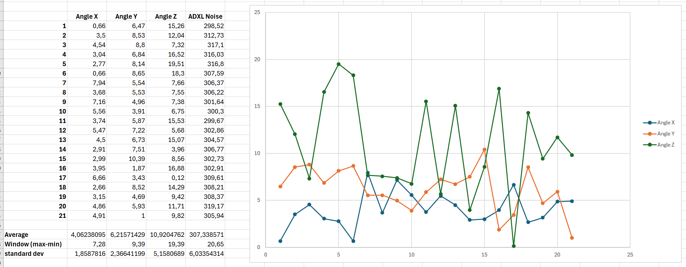

Übersetzung von: https://github.com/Frix-x/klippain-shaketune/blob/main/docs/macros/axes_map_calibration.md

# Kalibrierung des "axes_map" des Beschleunigungssensors

Alle von Shake&Tune generierten Grafiken zeigen Diagramme basierend auf Messungen deines Beschleunigungssensors, typischerweise gekennzeichnet mit den Achsen X, Y und Z. Wenn der Beschleunigungssensor gedreht ist, können seine Achsen nicht korrekt mit den Maschinenachsen ausgerichtet sein, was die Diagramme schwerer zu interpretieren, zu analysieren und zu verstehen macht. Das Makro `AXES_MAP_CALIBRATION` ist darauf ausgelegt, die Ausrichtung des Beschleunigungssensors automatisch zu messen, um sie korrekt einzustellen, was es dir einfacher denn je macht, das Beste aus deinen Daten herauszuholen!

  > **Hinweis**:
  >
  > Diese Fehlausrichtung beeinträchtigt nicht die Genauigkeit der Messungen, da die Gesamtsumme über alle Achsen in den meisten Shake&Tune-Tools verwendet wird. Es ist nur eine optionale, aber praktische Möglichkeit, den "axes_map"-Parameter von Klippers `[adxl345]` (oder welchen Beschleunigungssensor du auch hast) zu konfigurieren.

## Verwendung

Rufe das Makro `AXES_MAP_CALIBRATION` auf und suche im Ergebnisordner nach den Diagrammen. Hier sind die verfügbaren Parameter:

| Parameter | Standardwert | Beschreibung |
|-----------:|---------------|-------------|
|Z_HEIGHT|20|Z-Höhe, um den Werkzeugkopf vor Beginn der Bewegungen zu positionieren. Sei vorsichtig, wenn dein Beschleunigungssensor unter der Düse montiert ist, erhöhe ihn, um ein Aufprallen auf das Bett der Maschine zu vermeiden|
|SPEED|80|Geschwindigkeit des Werkzeugkopfs in mm/s für die Bewegungen|
|ACCEL|1500 (oder max. Druckerbeschleunigung)|Beschleunigung in mm/s², die für alle Bewegungen verwendet wird|
|TRAVEL_SPEED|120|Geschwindigkeit in mm/s, die für alle Reisebewegungen verwendet wird|

  > **Hinweis**:
  >
  > Dieser Befehl funktioniert nur, wenn du denselben Beschleunigungssensor in alle 3 Richtungen bewegen kannst, wie bei einem Voron V2.4 Drucker. Wenn du 2 Beschleunigungssensoren an deiner Maschine hast, wie bei einem Prusa, Switchwire oder Ender3, funktioniert es nicht, weil es unmöglich ist, die Orientierung des Beschleunigungssensors mit nur einer Bewegung zu erkennen (wie für das Bett).


Während der Messung bewegt sich die Maschine leicht in +X, +Y und +Z. Dies ermöglicht es, die Orientierung des Beschleunigungssensors automatisch zu erkennen.

Verwende diesen Wert in deiner `printer.cfg` Konfigurationsdatei:
```
[adxl345] # ersetze "adxl345" durch den Namen deines korrekten Beschleunigungssensors
axes_map: -z,y,x
```

### Beschleunigungsdiagramm

Dieses Diagramm zeigt die Beschleunigungsdaten über die Zeit für die Achsen X, Y und Z an, nachdem der Gravitationsversatz entfernt wurde. Suche nach Mustern in den Beschleunigungsdaten für jede Achse: Du solltest genau 2 Spitzen für jedes Unterdiagramm haben (für den Start und Stopp der Bewegung), die sich vom globalen Rauschen abheben. Dies kann helfen, Anomalien oder Inkonsistenzen im Verhalten deines Beschleunigungssensors zu identifizieren.

Das dynamische Rauschen und die Hintergrundvibrationen, die vom Beschleunigungssensor gemessen werden, werden aus dem Signal extrahiert (unter Verwendung der Wavelet-Transformation-Zerlegung) und in der Legende gedruckt. **Normalerweise sind Werte unter etwa 500mm/s² in Ordnung**, aber Shake&Tune wird automatisch eine Anmerkung hinzufügen, wenn zu viel Rauschen aufgezeichnet wird. **Sei vorsichtig, da dieser Wert sehr unterschiedlich ist zum Klippers `MEASURE_AXES_NOISE`-Befehl, da Shake&Tune alles während der Bewegung misst**, wie Beschleunigungssensorrauschen, aber auch Vibrationen und Motorengeräusche, Achsen- und Werkzeugkopfoszillationen usw. Wenn du deinen axes_map korrekt aufzeichnen möchtest, musst du möglicherweise etwa das 10-fache dieses Werts im `ACCEL`-Parameter verwenden, um ein gutes Signal-Rausch-Verhältnis zu erhalten und Shake&Tune die Beschleunigungs- und Verzögerungsphasen des Werkzeugkopfs korrekt erkennen zu lassen.

Der erkannte Gravitationsversatz wird in der Legende gedruckt, um etwas Kontext zu den Messwerten und deren Skala zu geben: Wenn er zu weit vom Standard 9.8-10 m/s² entfernt ist, bedeutet dies, dass dein Beschleunigungssensor nicht richtig funktioniert und repariert oder kalibriert werden sollte.

### Geschätzter 3D-Bewegungspfad

Dieses Diagramm visualisiert den geschätzten Pfad des Werkzeugkopfs, wie er vom Beschleunigungssensor im 3D-Raum aufgezeichnet wurde. Bedenke, dass, obwohl Shake&Tune einige mathematische Tricks verwendet, um etwas so genau wie möglich zu erhalten, wir kein Gyroskop haben, um den Beschleunigungsdrift zu kompensieren, und dieses Diagramm immer noch weitgehend eine "Schätzung" ist.

Beim Betrachten solltest du auf die Konsistenz des Pfads achten, indem du die Gleichmäßigkeit der Pfade (orangefarbene gepunktete Linien) überprüfst: Sie sollten größtenteils linear sein. Ideal sollten die berechneten Richtungsvektoren (in Lila) entlang einer der primären Achsen (X, Y oder Z) ausgerichtet erscheinen, mit minimalem Winkelabweichungsfehler, was auf eine genaue Ausrichtung des Beschleunigungssensorchips mit der Maschinenachse hinweist.

Bedenke, dass diese Grafik eine Schätzung ist und es zwischen aufeinanderfolgenden Durchläufen Variationen geben kann, insbesondere bei den berechneten Winkeln. Zum Beispiel hatte ich auf meiner Maschine diese Ergebnisse über 20 aufeinanderfolgende Durchläufe (mittlerer quadratischer Fehler etwa 3 bis 5 Grad):


