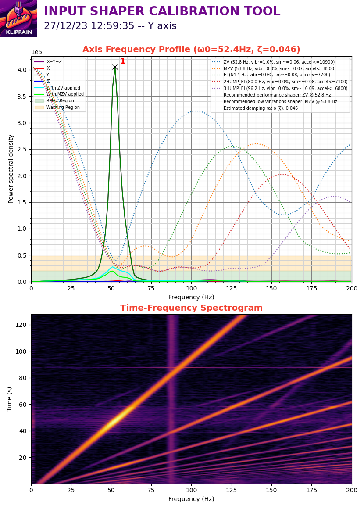

Übersetzung von: https://github.com/Frix-x/klippain-shaketune/edit/main/docs/macros/axes_shaper_calibrations.md

# Kalibrierung der Eingabeshaper-Filter

Das Makro `AXES_SHAPER_CALIBRATION` wird verwendet, um die Frequenzprofile deiner Maschinenachsen zu messen und darzustellen, um Klippers Eingabeshaping-System einzustellen.

## Verwendung

**Bevor du anfängst, stelle sicher, dass die Riemen richtig gespannt sind** und dass du bereits gute und klare Riemen-Diagramme hast (siehe [den vorherigen Abschnitt](./belts_tuning.md)).

Rufe dann das Makro `AXES_SHAPER_CALIBRATION` auf und suche im Ergebnisordner nach den Diagrammen. Hier sind die verfügbaren Parameter:

| Parameter | Standardwert | Beschreibung |
|-----------:|---------------|-------------|
|FREQ_START|Keiner (Standardwert aus `[resonance_tester]`)|Startfrequenz der Anregung|
|FREQ_END|Keiner (Standardwert aus `[resonance_tester]`)|Maximale Anregungsfrequenz|
|HZ_PER_SEC|1|Anzahl der Hz pro Sekunde für den Test|
|ACCEL_PER_HZ|Keiner (Standardwert aus `[resonance_tester]`)|Beschleunigung pro Hz, die für den Test verwendet wird|
|AXIS|"all"|Achse, die du testen möchtest, aus der Liste "all", "X" oder "Y"|
|SCV|Drucker Eckgeschwindigkeit|Eckgeschwindigkeit, die du verwenden möchtest, um Shaper-Empfehlungen zu berechnen. Höhere SCV-Werte führen in der Regel zu mehr Glättung und niedrigeren maximalen Beschleunigungen|
|MAX_SMOOTHING|Keiner|maximale Glättung, die bei der Berechnung der Shaper-Empfehlungen erlaubt ist|
|TRAVEL_SPEED|120|Geschwindigkeit in mm/s, die für alle Reisebewegungen verwendet wird (um zur Startposition vor dem Test zu gelangen)|
|Z_HEIGHT|Keiner|Z-Höhe, die für den Test gewünscht wird. Dieser Wert kann verwendet werden, um bei Bedarf den Z-Wert des probe_point in deinem `[resonance_tester]` Konfigurationsabschnitt zu überschreiben|


## Allgemeines zu IS-Diagrammen

Um Eingabeshaper-Diagramme effektiv zu analysieren, gibt es keinen universellen Ansatz aufgrund der Vielzahl von Faktoren, die die Leistung des 3D-Druckers oder die Messungen des Eingabeshapers beeinflussen können. Hier sind jedoch einige Hinweise zur Interpretation der Diagramme:
  - Ein Diagramm mit einem **einzigen und dünnen Peak**, der sich gut vom Hintergrundrauschen abhebt, ist ideal, da es leicht durch Eingabeshaping gefiltert werden kann. Je nach Maschine und deren mechanischer Konfiguration ist es jedoch nicht immer möglich, diese Form zu erhalten. Der Schlüssel zu besseren Diagrammen ist eine saubere mechanische Montage mit einem besonderen Fokus auf die Steifigkeit und Festigkeit von allem, vom Tisch, auf dem der Drucker steht, bis zum Rahmen und dem Werkzeugkopf.
  - Wie bei den Riemen-Diagrammen **konzentriere dich auf die Form der Diagramme, nicht auf die Werte**. Tatsächlich liefert der Energie-Wert nicht viele nützliche Informationen. Verwende ihn nur, um zwei deiner eigenen Diagramme zu vergleichen und die Auswirkungen deiner mechanischen Änderungen zwischen zwei aufeinanderfolgenden Tests zu messen, aber niemals, um sie mit Diagrammen von anderen Personen oder anderen Maschinen zu vergleichen.


Für die Einstellung deiner Eingabeshaping-Filter verlasse dich auf die automatisch berechneten Werte, die in der oberen rechten Ecke des Diagramms angezeigt werden. Hier ist eine Erklärung der Legende für ein besseres Verständnis:
  - **Filteralgorithmen**: Diese Berechnung funktioniert ziemlich gut, wenn die Diagramme sauber genug sind. Aber wenn deine Diagramme schlecht sind, kann sie keine Wunder vollbringen und wird dir ziemlich schlechte Empfehlungen geben. Es ist besser, die mechanischen Probleme zuerst zu adressieren, bevor du weitermachst. Jeder Shaper hat seine Vor- und Nachteile:
    * `ZV` ist ein ziemlich leichter Filter und hat normalerweise einige verbleibende Vibrationen. Verwende ihn nur, wenn du Geschwindigkeitstests machen möchtest und die höchsten Beschleunigungen bei geringer Glättung deiner Teile erreichen möchtest. Wenn du "perfekte" Diagramme hast und dir etwas verbleibendes Ringing nichts ausmacht, kannst du ihn ausprobieren.
    * `MZV` ist normalerweise die erste Wahl für gut eingestellte Maschinen. Es ist ein guter Kompromiss für geringe verbleibende Vibrationen und erlaubt dennoch ziemlich gute Beschleunigungen. Beachte, dass `MZV` nur bei guten Diagrammen empfohlen wird.
    * `EI` kann als Ausweichoption für herausfordernde Diagramme verwendet werden. Aber versuche zuerst, deine mechanischen Probleme zu beheben, bevor du ihn verwendest: fast jeder Drucker sollte stattdessen `MZV` verwenden können.
    * `2HUMP_EI` und `3HUMP_EI` sind letzte Ausweichmöglichkeiten, da sie normalerweise zu einem hohen Grad an Glättung führen. Wenn sie als Hauptvorschläge auftauchen, ist es wahrscheinlich, dass deine Maschine zugrunde liegende mechanische Probleme hat (die zu ziemlich schlechten oder "breiten" Diagrammen führen).
  - **Empfohlene Beschleunigung** (`accel<=...`): Dies ist kein eigenständiger Wert: Du musst auch die `vibr`- und `sm`-Werte berücksichtigen, da es ein Kompromiss zwischen den dreien ist. Sie geben dir die verbleibenden Vibrationen und die Glättung nach dem Eingabeshaping bei der empfohlenen Beschleunigung. Nichts hindert dich daran, höhere Beschleunigungswerte zu verwenden; sie sind keine Grenze. In diesem Fall kann das Eingabeshaping jedoch nicht alle Ringing-Effekte auf deinen Teilen unterdrücken, und es wird mehr Glättung auftreten. Denke daran, dass hohe Beschleunigungen überhaupt nicht nützlich sind, wenn noch ein hohes Maß an verbleibenden Vibrationen vorhanden ist: Du solltest zuerst alle mechanischen Probleme beheben.
  - **Verbleibende Vibrationen** (`vibr`): Diese stehen direkt mit Ringing in Verbindung. Idealerweise möchtest du einen Filter mit minimalen verbleibenden Vibrationen.
  - **Shaper-Empfehlungen**: Dieses Skript gibt dir einige maßgeschneiderte Empfehlungen basierend auf deinen Diagrammen. Wähle den aus, der deinen Bedürfnissen entspricht:
    * Der "Performance"-Shaper, der für die meisten Menschen gut sein sollte, da er ein Kompromiss für hohe Beschleunigungen mit geringen verbleibenden Vibrationen ist, der die meisten Ringing-Effekte auf deinen Teilen entfernen sollte.
    * Der "Low Vibration"-Shaper zielt auf ein niedrigeres Niveau verbleibender Vibrationen ab, um die beste Druckqualität mit minimalem Ringing zu gewährleisten. Dies sollte verwendet werden, falls der Performance-Shaper nicht ausreichend für deine Bedürfnisse ist.
    * Manchmal wird nur eine einzige Empfehlung als "bester" Shaper gegeben. Das bedeutet, dass entweder kein geeigneter "Performance"-Shaper gefunden wurde (aufgrund eines hohen Niveaus an verbleibenden Vibrationen oder zu viel Glättung), oder dass der "Low Vibration"-Shaper derselbe wie der "Performance"-Shaper ist.
  - **Dämpfungsverhältnis**: Am Ende siehst du eine Schätzung basierend auf deinen gemessenen Daten, die verwendet wird, um die Shaper-Empfehlungen besser auf deine Maschine zuzuschneiden. Du musst es im Abschnitt `[input_shaper]` definieren.

Füge dann zu deiner Konfiguration hinzu:
```
[input_shaper]
shaper_freq_x: ... # Zentralfrequenz für den X-Achsen-Filter
shaper_type_x: ... # Filtertyp für die X-Achse


shaper_freq_y: ... # Zentralfrequenz für den Y-Achsen-Filter
shaper_type_y: ... # Filtertyp für die Y-Achse
damping_ratio_x: ... # Dämpfungsverhältnis für die X-Achse
damping_ratio_y: ... # Dämpfungsverhältnis für die Y-Achse
```

## Nützliche Fakten und Mythenentlarvung

Manche Leute schlagen vor, Daten bei 100 Hz zu kappen, indem sie die .csv-Datei manuell bearbeiten, weil sie denken, dass Werte darüber falsch sind. Aber das kann irreführend sein. Die Anregungs- und Systemantwortfrequenzen unterscheiden sich und sind nicht direkt miteinander verbunden. Du könntest Vibrationen über den Anregungsbereich hinaus sehen, und sie aus der Datei zu entfernen, verdeckt nur potenzielle Probleme. Obwohl diese hochfrequenten Vibrationen nicht immer die Druckqualität beeinflussen, könnten sie mechanische Probleme signalisieren. Anstatt sie zu verbergen, solltest du versuchen, diese Probleme zu lösen.

Bezüglich der Druckerkomponenten empfehle ich nicht, einen extra leichten X-Balken (Aluminium oder Carbon) zu verwenden. Sie mögen aufgrund ihres Gewichts ideal erscheinen, aber es gibt mehr zu beachten als nur die Masse, wie die Steifigkeit (siehe [die Theorie dahinter](../is_tuning_generalities.md#theory-behind-it)). Diese leichten Balken können flexibler sein und sich negativ auf die Y-Achsen-Diagramme auswirken, da sie unter hohen Beschleunigungen nachgeben.

Denke schließlich daran, dass jede Achse ihre eigenen Eigenschaften hat, wie Masse und Geometrie, die zu unterschiedlichem Verhalten führen werden und unterschiedliche Filter erfordern. Dieselben Eingabeshaping-Einstellungen für beide Achsen zu verwenden, ist nur gültig, wenn beide Achsen mechanisch ähnlich sind: Dies mag für einige Maschinen zutreffen, hauptsächlich für Cross-Gantry-Konfigurationen wie [CroXY](https://github.com/CroXY3D/CroXY) oder [Annex-Engineering](https://github.com/Annex-Engineering)-Drucker, aber nicht für andere.


## Beispiele für Diagramme

In diesem Abschnitt führe ich dich durch einige zufällige Diagramme, die online gefunden oder mir zur Analyse geteilt wurden. Mein Ziel ist es, das Gute und das Nicht-so-Gute hervorzuheben und dir Einblicke zu geben, um die Eingabeshaping-Einstellungen deines Druckers zu verfeinern.

Das gesagt, ist die Interpretation von Eingabeshaper-Diagrammen keine exakte Wissenschaft. Während wir gebildete Vermutungen anstellen und potenzielle Probleme aus diesen Diagrammen hervorheben können, ist es nicht immer möglich, genaue Ursachen zu identifizieren. Daher betrachte die kommenden Diagramme und ihre Kommentare als Wegweiser auf deiner Reise durch das Eingabeshaping, anstatt als unumstößliche Wahrheiten.

### Gute Diagramme

Diese beiden Diagramme gelten als gut und sind das, was du anstreben solltest. Sie zeigen jeweils einen einzelnen, deutlichen Peak, der sich klar vom Hintergrundrauschen abhebt. Beachte, dass die Hauptfrequenzen der Peaks in den X- und Y-Diagrammen unterschiedlich sind. Diese Varianz ist erwartet und normal, wie im letzten Punkt des Abschnitts [Nützliche Fakten und Mythenentlarvung](#useful-facts-and-myths-debunking) erklärt. Das Spektrogramm ist sauber, nur mit den Resonanzdiagonalen. Beachte, dass während des Tests ein Lüfter lief, wie durch die lila vertikale Linie gezeigt (siehe Abschnitt [Lüfter](#fan-behavior)).

| Gutes X-Diagramm | Gutes Y-Diagramm |
| --- | --- |
|  |  |

### Niedrige Frequenzenergie

Diese Diagramme haben eine niedrige Frequenz (nahe 0 Hz) bei einer eher niedrigen maximalen Amplitude (um 1e2 oder 1e3) Signal. Das bedeutet, dass es zu Bindungen, Reibungen oder Schleifen während der Bewegung kommt: grundsätzlich bewegt sich etwas nicht frei. Geringfügige niedrige Frequenzenergie in den Diagrammen kann auf viele Probleme zurückzuführen sein, wie z.B. fehlerhafte Umlenkrollen/Lager oder eine zu fest angezogene Wagenschraube, die verhindert, dass sie sich frei auf ihrer Linearführung bewegt, ein Riemen, der auf einem Lagerflansch läuft, ... Große Mengen an niedriger Frequenzenergie deuten jedoch auf wichtigere Probleme hin, wie z.B. falsche Riemenführung (am häufigsten), oder defekte Motoren, ...

Hier ist, wie du das Problem beheben kannst:
  1. **Riemenuntersuchung**:
     - Stelle sicher, dass deine Riemen richtig geführt sind.
     - Überprüfe die korrekte Ausrichtung der Riemen auf allen Lagerflanschen während der Bewegung (überprüfe sie während eines Drucks).
     - Riemenstaub ist oft ein Zeichen für Fehlausrichtung oder Verschleiß.
  2. **Verhalten des Werkzeugkopfs bei CoreXY-Druckern**: Bei ausgeschalteten Motoren und zentriertem Werkzeugkopf, schiebe die Y-Achse von vorne nach hinten. Der Werkzeugkopf sollte sich nicht nach links oder rechts bewegen. Wenn doch, könnte einer der Riemen blockiert sein und muss untersucht werden, um das Problem zu finden.
  3. **Quadratur des Portals**:
     - Stelle sicher, dass dein Portal perfekt parallel und quadratisch ist. Du kannst dich für eine Anleitung an [Nero3Ds De-Racking-Video](https://youtu.be/cOn6u9kXvy0?si=ZCSdWU6br3Y9rGsy) wenden.
     - Nachdem du die Riemen entfernt hast, teste die Bewegung des Werkzeugkopfs von Hand in allen Positionen. Die Bewegung sollte glatt sein, ohne harte Punkte oder Widerstandsbereiche.

| Kleine Bindung | Starke Bindung |
| --- | --- |
|  |  |

### Doppelpeaks oder breite Peaks

Solche Diagrammmuster können aus verschiedenen Faktoren entstehen, und es gibt keine universelle Lösung. Um sie anzugehen:

1. Ein wackeliger Tisch kann die Ursache sein. Als Erstes solltest du versuchen, den Drucker direkt auf dem Boden zu platzieren.
2. Stelle eine optimale Riemen-Spannung mit dem [`COMPARE_BELTS_RESPONSES` Makro](./belts_tuning.md) sicher.
3. Wenn die Probleme weiterhin bestehen, könnte es an einem nicht ordnungsgemäß ausgerichteten Portal liegen. Zur Korrektur kannst du [Nero3Ds De-Racking-Video](https://youtu.be/cOn6u9kXvy0?si=ZCSdWU6br3Y9rGsy) heranziehen.
4. Wenn es immer noch vorhanden ist, musst du herausfinden, was genau resoniert, um es zu beheben. Du kannst das Makro `EXCITATE_AXIS_AT_FREQ` verwenden, um es zu finden.

| Zwei Peaks | Ein breiter Peak |
| --- | --- |
|  |  |

### Problematische CANBUS-Geschwindigkeit

Die Verwendung von CANBUS-Werkzeugköpfen mit integriertem Beschleunigungssensor kann manchmal Herausforderungen darstellen, wenn die CANBUS-Geschwindigkeit zu niedrig eingestellt ist. Während Benutzer die Busgeschwindigkeit senken könnten, um Timing-Fehler von Klipper zu beheben, beeinflusst diese Änderung auch die Messungen zur Eingabeformung. Ein Beispiel für das Ergebnis einer niedrigen Busgeschwindigkeit ist das folgende Diagramm, das, obwohl es generell gut geformt ist, überall gezackt und spitz erscheint. Es könnte auch zusätzliche Niederfrequenzenergie vorhanden sein. Für einen optimalen Betrieb des Beschleunigungssensors auf deinem CANBUS-Werkzeugkopf ist eine Einstellung von 500k das Minimum, aber 1M ist empfehlenswert. Du könntest einen Blick auf [diesen ausgezeichneten Leitfaden von Esoterical](https://github.com/Esoterical/voron_canbus/tree/main) werfen.

| CANBUS-Problem vorhanden | CANBUS-Problem gelöst |
| --- | --- |
|  |  |

### Werkzeugkopf- oder TAP-Schwanken

Der [Voron TAP](https://github.com/VoronDesign/Voron-Tap) kann Anomalien in den Eingabeshaper-Diagrammen verursachen, insbesondere im X-Diagramm. Sein Design mit einer internen MGN-Schiene führt eine separate und entkoppelte Masse ein, was zu seiner eigenen Resonanz führt, typischerweise um 125Hz.

Kleine 125Hz-Peaks sind auch meistens auf den Werkzeugkopf selbst zurückzuführen, da die meisten Werkzeugköpfe ungefähr die gleiche Masse haben. Häufige Ursachen sind lose Schrauben oder eine schlechte Qualität der X-Linearschiene, die etwas Spiel im Schlitten haben kann, was dazu führt, dass der Werkzeugkopf leicht schwankt. Dies wird oft als Z-Komponente in den Diagrammen gezeigt und kann durch den Bowdenzug oder ein Kabel, das einige Kräfte auf den Werkzeugkopf ausübt, verstärkt werden.
