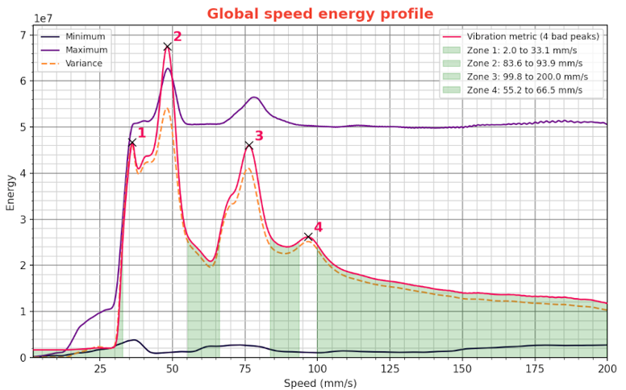
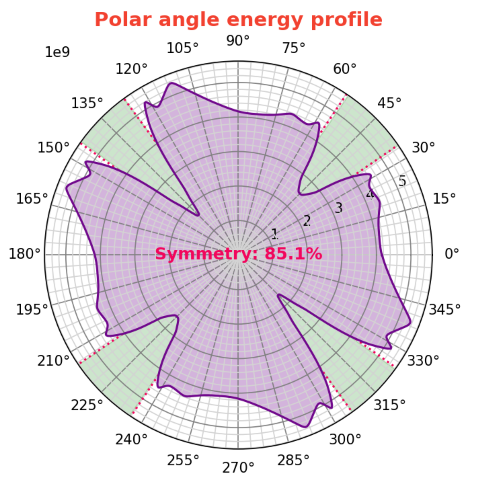
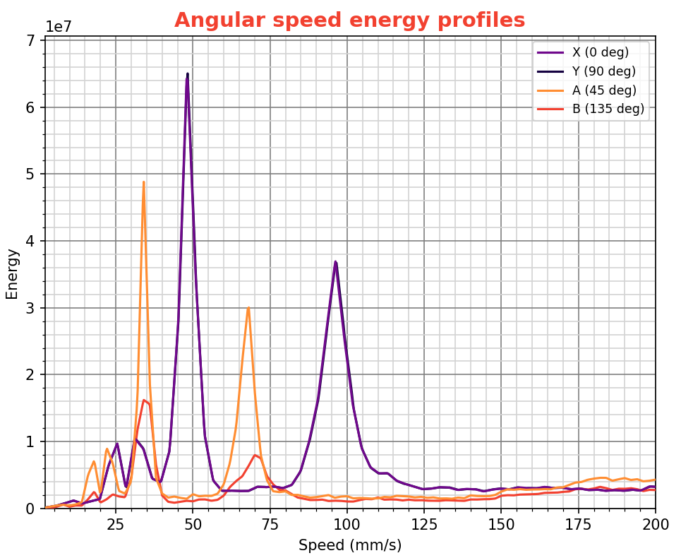
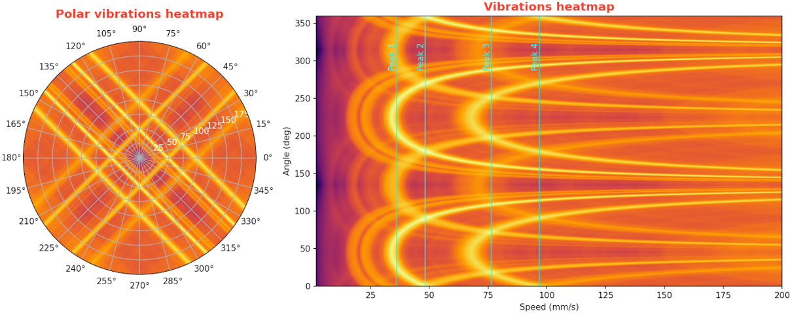
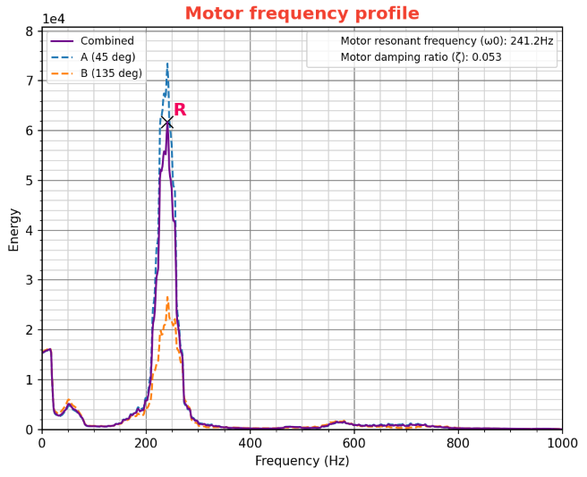

Übersetzung von: https://github.com/Frix-x/klippain-shaketune/blob/main/docs/macros/create_vibrations_profile.md

# Maschinenvibrationsprofile

Das Makro `CREATE_VIBRATIONS_PROFILE` analysiert Beschleunigungssensordaten, um das Vibrationsprofil deines 3D-Druckers zu plotten. Die resultierenden Diagramme heben optimale Druckgeschwindigkeiten und -winkel hervor, die die geringsten Vibrationen erzeugen. Es bietet eine technische Basis für Anpassungen in deinen Slicer-Profilen, aber auch in der Hardwarekonfiguration und TMC-Treiberparametern, um die Druckqualität zu verbessern und VFAs (vertikale Feinartefakte) zu reduzieren.

  > **Warnung**
  >
  > Du musst zuerst die Standard-Eingabeshaper-Algorithmen von Klipper mit den anderen Makros kalibrieren! Dieser Test sollte als letzter Schritt verwendet werden, um deinen Drucker mit Shake&Tune zu kalibrieren.


## Verwendung

Rufe das Makro `CREATE_VIBRATIONS_PROFILE` mit dem Geschwindigkeitsbereich auf, den du messen möchtest. Hier sind die verfügbaren Parameter:

| Parameter | Standardwert | Beschreibung |
|-----------:|---------------|-------------|
|SIZE|100|Durchmesser in mm des Kreises, in dem die aufgezeichneten Bewegungen stattfinden|
|Z_HEIGHT|20|Z-Höhe, um den Werkzeugkopf vor Beginn der Bewegungen zu positionieren. Sei vorsichtig, wenn dein Beschleunigungssensor unter der Düse montiert ist, erhöhe sie, um ein Aufprallen auf das Bett der Maschine zu vermeiden|
|MAX_SPEED|200|Maximale Geschwindigkeit des Werkzeugkopfs in mm/s zur Aufzeichnung für die Analyse|
|SPEED_INCREMENT|2|Geschwindigkeitserhöhungen des Werkzeugkopfs in mm/s zwischen jeder Bewegung|
|ACCEL|3000|Beschleunigung in mm/s², die für alle Bewegungen verwendet wird. Versuche, sie relativ niedrig zu halten, um dynamische Effekte zu vermeiden, die die Messungen verändern, aber hoch genug, um eine konstante Geschwindigkeit für >~70% der Segmente zu erreichen. 3000 ist ein vernünftiger Standard für die meisten Drucker, es sei denn, du möchtest mit sehr hoher Geschwindigkeit aufzeichnen, in diesem Fall solltest du SIZE erhöhen und ACCEL etwas verringern.|
|TRAVEL_SPEED|120|Geschwindigkeit in mm/s, die für alle Reisebewegungen verwendet wird|
|ACCEL_CHIP|Keiner|Name des Beschleunigungschips aus deiner Klipper-Konfiguration, den du für den Test erzwingen möchtest|

Die Ergebnisse des `CREATE_VIBRATIONS_PROFILE`-Makros bestehen aus einem Satz von 6 Diagrammen. Oben in der Abbildung siehst du auch alle erkannten Motor-, Strom- und TMC-Treiberparameter. Diese Notizen dienen nur als Referenz, falls du mit ihnen herumtüfteln möchtest und nicht vergessen willst, was du zwischen jedem Durchlauf des Makros geändert hast.


### Globales Geschwindigkeits-Energie-Profil

| Beispiel | Beschreibung |
|:-----|-------------|
||Dieses Diagramm zeigt die Beziehung zwischen der Geschwindigkeit des Werkzeugkopfs (mm/s) und der Vibrationsenergie und bietet eine globale Ansicht darüber, wie die Geschwindigkeit die Vibrationen über alle Bewegungen hinweg beeinflusst. Durch die Verwendung von Geschwindigkeiten aus den grünen Zonen läuft dein Drucker reibungsloser, und du minimierst Vibrationen und damit verbundene feine Artefakte in Drucken|

Dieses Diagramm ist das wichtigste Werkzeug dieses Tools. Du möchtest es nutzen, um dein Slicer-Profil anzupassen, insbesondere indem du die "Vibrationsmetrik"-Kurve betrachtest, die dir hilft herauszufinden, welche Geschwindigkeiten problematisch für deinen Drucker sein könnten. Hier ist die Magie dahinter, aufgeteilt in zwei Hauptteile:
  1. **Spektrumvarianz**: Das ist wie der Stimmungsring deines Druckers, der zeigt, wie sich die Vibes (auch bekannt als Vibrationen) ändern, wenn aus verschiedenen Winkeln gedruckt wird. Wenn die "Vibrationsmetrik" niedrig ist, bedeutet das, dass dein Drucker seine Coolness bewahrt und konsistent bleibt, egal aus welchem Winkel. Aber wenn sie ansteigt, ist das ein Zeichen dafür, dass einige Winkel deinen Drucker mehr zittern lassen als ein koffeinhörnchen Eichhörnchen. *Stell dir vor, du suchst eine entspannte Party-Atmosphäre, wo die Musik aus jedem Winkel gut ist, nicht eine, wo du um die Ecke biegst und plötzlich ist es zu laut oder zu leise.*
  2. **Spektrum Maximum**: Dieser Teil handelt vom maximalen Volumen der Party oder davon, wie laut die stärkste Vibration über alle Winkel bei jeder Geschwindigkeit ist. Wir zielen darauf ab, Geschwindigkeiten zu vermeiden, die das Volumen zu hoch drehen und eine Resonanzrave in den Motoren verursachen. *Denke darüber nach: Du möchtest nicht, dass der Bass so hoch ist, dass es sich anfühlt, als würde dein Herz aus deiner Brust schlagen. Wir suchen nach einem schönen Hintergrundniveau, wo jeder plaudern und eine gute Zeit haben kann.*

Und warum kümmern wir uns so sehr darum, diese Geschwindigkeiten zu finden? Weil der Werkzeugkopf während eines Drucks in alle Richtungen bewegt wird, abhängig von der Geometrie, und wir eine Geschwindigkeit wollen, die wie ein guter Freund ist, zuverlässig in jeder Situation. Glücklicherweise, da die Motoren in unseren Druckern ihre Vibes ohne nichtlineares Mischen teilen und sich einfach addieren (denke daran, als würde jeder seinen eigenen Tanz machen, ohne sich gegenseitig zu stoßen), können wir diese glücklichen grünen Zonen auf dem Diagramm finden: das sind die Geschwindigkeiten, die die Stimmung kühl halten und die Energie genau richtig machen, was sie perfekt für alle deine Druckaufträge macht.

### Polares Winkelenergieprofil

| Beispiel | Beschreibung |
|:-----|-------------|
||Zeigt, wie die Vibrationsenergie je nach Richtung variiert, in der der Werkzeugkopf läuft. Es hilft dabei, Winkel zu identifizieren, die weniger Vibrationen erzeugen, und möglicherweise Asymmetrien in den Riemenwegen bei einem CoreXY-Drucker zu erkennen.|

Dieses Diagramm ist wie deine Lieblingsplaylist, um jene Winkel zu finden, bei denen die Stimmung genau richtig ist. Aber hier ist der Haken: Beim Drucken wird sich dein Werkzeugkopf in alle Richtungen und Winkel bewegen, abhängig von der Geometrie deiner Teile, daher ist es nicht möglich, sich nur auf einen Winkel zu beschränken. Mein Tipp, um das Beste aus diesem Diagramm für deine Drucke herauszuholen: Wenn du an etwas Rechteckigem arbeitest, versuche es so auszurichten, dass die meisten Kanten mit den Winkeln übereinstimmen, die am wenigsten dazu neigen, deinen Drucker ins Wackeln zu bringen. Für die schicken CoreXY-Drucker ist normalerweise das Zielen auf 45/135 Grad ein Treffer, während die zuverlässigen kartesischen Drucker am besten bei 0/90 Grad funktionieren. Und für alles andere? Nun, es gibt hier nicht viel mehr zu tun, außer sich auf das [Globale Geschwindigkeitsenergieprofil](#global-speed-energy-profile) zu verlassen, um die Geschwindigkeiten deines Slicer-Profils entsprechend anzupassen.

Jetzt zum Symmetrieindikator. Denke an dieses Werkzeug als den Tanzcoach deines Druckers, speziell entwickelt für solche mit einem symmetrischen Aufbau wie CoreXY-Modelle. Es geht darum, ziemlich coole Mathematik (Kreuzkorrelation, um genau zu sein) zu verwenden, um die Vibes von beiden Seiten der Tanzfläche zu überprüfen. Stelle es dir vor wie einen Top-Party-Tänzer, der den Raum aus jedem Winkel scannt, jeden Tänzer beurteilt und nur Top-Noten vergibt, wenn jeder perfekt synchron ist. Dieses Werkzeug ist spitze darin, jede Heimlichkeit in deiner Motorsteuerung oder deinem Riemenweg zu erwischen, indem es "Schmetterlings" -Formen oder auch die geringsten Variationen in den Resonanzmustern der Motoren hervorhebt. Es ist, als hättest du eine Lupe, die genau zeigt, wo die Partyfehler sind, und dir hilft, sie zu beheben und deine Drucke reibungslos und atemberaubend herausrollen zu lassen.

### Winkelgeschwindigkeitsenergieprofile

| Beispiel | Beschreibung |
|:-----|-------------|
||Bietet eine detaillierte Ansicht darüber, wie sich die Energieverteilung mit der Geschwindigkeit für bestimmte Winkel ändert. Es ist nützlich, um Geschwindigkeiten für verschiedene Bewegungsrichtungen fein abzustimmen oder das Verhalten deines Druckers entlang der Hauptachsen zu verfolgen und zu diagnostizieren.|

Dieses Diagramm ist wie ein Schnappschuss, der die Stimmung bei bestimmten Winkeln deiner Druckparty einfängt. Aber denk daran, es ist nur ein Einblick in ein paar spezifische Winkel und enthüllt nicht die gesamte Tanzfläche, auf der sich der Werkzeugkopf in jede Richtung bewegt und mit der einzigartigen Geometrie deiner Teile vibriert. Also sieh es als eine Möglichkeit, einen Blick darauf zu werfen, wie jeder in jeder Ecke der Party groovt. Es ist großartig für einen schnellen Check-up, um zu sehen, wie die Stimmung sich hält, aber wenn es darum geht, den Rhythmus deiner Slicer-Geschwindigkeiten festzulegen, wirst du das [Globale Geschwindigkeitsenergieprofil](#global-speed-energy-profile) verwenden wollen.

### Vibrations-Heatmaps

| Beispiel | Beschreibung |
|:-----|-------------|
||Beide Diagramme bieten einen umfassenden Überblick über die Vibrationsenergie über Geschwindigkeiten und Winkel hinweg. Sie helfen visuell, Zonen hoher und niedriger Energie zu identifizieren, was zum umfassenden Verständnis des Verhaltens der Druckermotoren beiträgt. Es ist das, was vom Beschleunigungssensor erfasst wird und die Basis aller anderen Plots darstellt.|

Beide Heatmaps legen die Stimmung der Vibrationsenergie über alle Geschwindigkeiten und Winkel fest und malen ein Bild davon, wie der Beat sich über die Tanzfläche deines Druckers ausbreitet. Die polare Heatmap gibt dir einen 360-Grad-Wirbel der Action, während die reguläre sie in einem klassischen 2D-Groove darlegt, doch beide vibrieren zur gleichen Melodie und zeigen dir, wo die Energie heiß und knallend ist und wo sie kühl und sanft ist, quer durch den Betriebsbereich deines Druckers. Denke daran als den einzigartigen Fingerabdruck des Verhaltens deines Motors, erfasst vom Beschleunigungssensor, es ist der rohe Rhythmus deines Druckers in Aktion.

Da die Skala sowohl normalisiert als auch logarithmisch ist, suchst du nach einer Heatmap (oder einem Spektrogramm), das durchgehend eine kühle, konstante "orange" Stimmung hat, was darauf hinweist, dass es über das Spektrum hinweg nicht viel Veränderung gibt, mit ziemlich niedrigen Motorresonanzen. Siehst du Bereiche in deiner Heatmap, die von tiefem Lila/Schwarz zu hellem Weiß/Gelb wechseln? Das ist ein Zeichen dafür, dass deine Druckermotoren bei bestimmten Winkeln und Geschwindigkeitskombinationen hohe Resonanzen erreichen, die über den Baseline-Vibrationen außerhalb dieser Bereiche liegen. Aber denk daran, das ist nur die Lage des Landes, ein Schnappschuss der Szene: Diese Stimmung direkt zu verändern, ist vielleicht nicht einfach, aber du kannst immer noch [mit den TMC-Treiberparametern herumspielen](#improving-the-results), um die Beats anzupassen und einen glatteren Rhythmus zu finden.

### Motorfrequenzprofil

| Beispiel | Beschreibung |
|:-----|-------------|
||Identifiziert die Resonanzfrequenzen der Motoren und ihre Dämpfungsverhältnisse. Informativ für jetzt, wird aber später verwendet.|

Für jetzt ist dieses Diagramm rein informativ und misst das natürliche Resonanzprofil des Motors. Denke an dieses Diagramm als einen kleinen Einblick in das Innenleben der Tanzfläche deines Druckers. Es ist noch nicht ganz bereit, auf der Hauptbühne praktisch verwendet zu werden, aber warte nur... Behalte dieses Diagramm im Auge, denn es deutet auf zukünftige Remixe hin, bei denen du DJ spielen und die Leistung deines Druckers wie nie zuvor optimieren kannst.


## Verbesserung der Ergebnisse

Diese Diagramme stellen im Wesentlichen das Verhalten der Motorsteuerung deiner Maschine dar. Während es nicht viel Spielraum für einfache Anpassungen zur Verbesserung gibt, sollten die meisten von euch sie nur nutzen, um euer Slicer-Profil zu konfigurieren, um problematische Geschwindigkeiten zu vermeiden.

Wenn du jedoch tiefer in die Materie eindringen möchtest, da die Daten in diesen Diagrammen größtenteils von der Art der Motoren, ihren physischen Eigenschaften und der Art und Weise abhängen, wie sie von den TMC-Treibern gesteuert werden, gibt es Optimierungsmöglichkeiten. Das Anpassen der TMC-Parameter ermöglicht es, die Peaks anzupassen, die Maschinenleistung zu verbessern oder das Gesamtmaschinengeräusch zu verringern. Für diesen Prozess empfehle ich, direkt das [Klipper TMC Autotune](https://github.com/andrewmcgr/klipper_tmc_autotune) Plugin zu verwenden, das alles erheblich vereinfachen sollte. Aber bedenke, dass es sich immer noch um ein experimentelles Plugin handelt und es nicht perfekt ist.

Für Personen, die bereit sind

, bis zum Ende des Kaninchenbaus vorzudringen und dies manuell zu handhaben, ist die Verwendung eines Oszilloskops obligatorisch. Die meisten benötigten Ressourcen sind direkt auf der Trinamics TMC-Website verfügbar:
  1. Du solltest zuerst das Datenblatt zu deinem TMC-Modell konsultieren, um Anleitung zu den Parameternamen und ihren jeweiligen Verwendungen zu erhalten.
  2. Dann, um die Parameter einzustellen, sieh dir die Anwendungshinweise auf ihrer Plattform an, insbesondere [AN001](https://www.trinamic.com/fileadmin/assets/Support/AppNotes/AN001-SpreadCycle.pdf), [AN002](https://www.trinamic.com/fileadmin/assets/Support/AppNotes/AN002-StallGuard2.pdf), [AN003](https://www.trinamic.com/fileadmin/assets/Support/AppNotes/AN003_-_DcStep_Basics_and_Wizard.pdf) und [AN009](https://www.trinamic.com/fileadmin/assets/Support/AppNotes/AN009_Tuning_coolStep.pdf).
  3. Für ein umfassenderes Verständnis möchtest du vielleicht auch [AN015](https://www.trinamic.com/fileadmin/assets/Support/AppNotes/AN015-StealthChop_Performance.pdf) und [AN021](https://www.trinamic.com/fileadmin/assets/Support/AppNotes/AN021-StealthChop_Performance_comparison_V1.12.pdf) erkunden, obwohl diese eher darauf ausgerichtet sind, das Verständnis zu verbessern als die Kalibrierung, ähnlich wie das TMC-Datenblatt.

Zur Referenz, die Standard-Einstellungen, die in Klipper verwendet werden, sind:
```
#driver_TBL: 2
#driver_TOFF: 3
#driver_HEND: 0
#driver_HSTRT: 5
```
