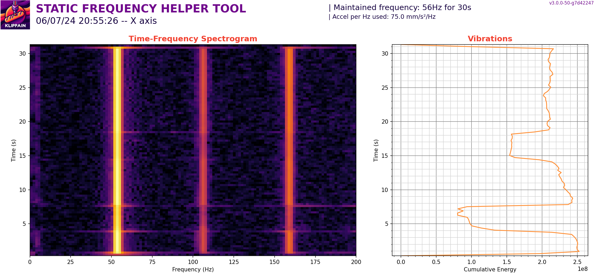

Übersetzung von: https://github.com/Frix-x/klippain-shaketune/blob/main/docs/macros/excitate_axis_at_freq.md

# Diagnose problematischer Spitzen

Das Makro `EXCITATE_AXIS_AT_FREQ` ist besonders nützlich zur Fehlersuche bei mechanischen Vibrationen oder Resonanzproblemen. Dieses Makro ermöglicht es, eine spezifische Anregungsfrequenz für eine festgelegte Dauer aufrechtzuerhalten und ermöglicht so eine praktische Diagnose.

## Verwendung

Hier sind die verfügbaren Parameter:

| Parameter | Standardwert | Beschreibung |
|-----------:|---------------|-------------|
|CREATE_GRAPH|0|Ob die Beschleunigungssensordaten aufgezeichnet und ein zugehöriges Diagramm während der Anregung erstellt werden sollen|
|FREQUENCY|25|Anregungsfrequenz (in Hz), die beibehalten werden soll. Üblicherweise ist dies die Frequenz eines Peaks in einem der Diagramme|
|DURATION|30|Dauer in Sekunden, für die diese Anregung aufrechterhalten werden soll|
|ACCEL_PER_HZ|Keiner (Standardwert aus `[resonance_tester]`)|Beschleunigung pro Hz, die für den Test verwendet wird|
|AXIS|x|Achse, die angeregt werden soll. Kann auf "x", "y", "a", "b" eingestellt werden|
|TRAVEL_SPEED|120|Geschwindigkeit in mm/s, die für alle Reisebewegungen verwendet wird (um zur Startposition vor dem Test zu gelangen)|
|Z_HEIGHT|Keiner|Z-Höhe, die für den Test gewünscht wird. Dieser Wert kann verwendet werden, um bei Bedarf den Z-Wert des probe_point in deinem `[resonance_tester]` Konfigurationsabschnitt zu überschreiben|
|ACCEL_CHIP|Keiner|Name des Beschleunigungschips aus deiner Klipper-Konfiguration, den du für den Test erzwingen möchtest|

**Standardmäßig erzeugt dieses Makro kein Diagramm**, weil du durch das Berühren der verschiedenen Komponenten deiner Maschine mit den Fingern die Vibrationen dämpfen und leicht feststellen kannst, welche Quelle von Problemen sind: das Berühren wird das Geräusch stoppen.

Wenn du jedoch etwas hast, das schwer mit den Ohren zu diagnostizieren ist, oder wenn du deine Experimente aufzeichnen oder die genauen Konsequenzen und Effekte deiner Modifikationen mit einem wissenschaftlicheren Ansatz dokumentieren möchtest, kannst du die Erstellung eines Diagramms aktivieren. **Denke jedoch daran, dass da der Beschleunigungssensor üblicherweise am Werkzeugkopf montiert ist, die Aufzeichnung den Vibrationen des Werkzeugkopfs entsprechen wird und nicht unbedingt ein anderes problematisches Bauteil irgendwo an der Maschine widerspiegeln wird**, es sei denn, es vibriert stark und seine Vibrationen werden bis zum Werkzeugkopf übertragen. Berücksichtige dies, wenn du die von diesem Makro generierten Diagramme betrachtest, und du möchtest den Beschleunigungssensor möglicherweise an anderen Stellen platzieren, um einen vollständigen Überblick zu erhalten.

### Spektrogramm und Vibrationsharmonische

Das Zeit-Frequenz-Spektrogramm visualisiert, wie sich der Frequenzinhalt des Signals über die Zeit ändert. Diese Darstellung hilft, dominante Frequenzen und Harmonische der angeregten Vibration zu identifizieren. Jede vertikale Linie ist eine davon und ein Teil der Vibrationen und Geräusche, die du hören kannst.

### Energieakkumulationsdiagramm

Das Energieakkumulationsdiagramm zeigt die kumulative Energie über die Zeit, integriert über alle Frequenzen. Grundsätzlich ist dieses Diagramm die Summe aller Vibrationen zu einem gegebenen Zeitpunkt während des Tests. Es kann dir also helfen, Perioden signifikanter Vibration zu bewerten und zu sehen, wie sich die Dinge ändern, wenn du diesen oder jenen Teil der Maschine berührst. Im obigen Beispiel habe ich die X-Achse meiner Maschine bei ihrer Hauptresonanzfrequenz (d. h. ihrem Hauptresonanzpeak in den IS-Diagrammen) vibrieren lassen und 3 Komponenten berührt:
  - Vom 4. bis zum 8. Sekunde des Tests berührte ich den Werkzeugkopf, der die meisten Vibrationsreduktionen aufwies, da er die Hauptkomponente ist, die bei dieser Frequenz vibriert und das Berühren sie stark dämpft.
  - Vom 14. bis zum 18. Sekunde berührte ich die Riemen, und dies reduzierte die Vibrationen ein wenig, aber nicht so viel wie das Berühren des Werkzeugkopfs.
  - Vom 23. bis zum 27. Sekunde berührte ich das linke XY-Gelenk meiner Maschine und es hatte keinen bemerkbaren Effekt auf die Vibrationen.

Wie oben erwähnt, **bedeutet dies nicht, dass das linke XY-Gelenk nicht zu den Vibrationen beiträgt**. Es bedeutet, dass seine Vibrationen kein Problem in den aufgezeichneten Werkzeugkopfvibrationen verursachen (weil der Beschleunigungssensor am Werkzeugkopf montiert war!!!), aber wenn du feststellst, dass dies auch das globale Geräusch reduziert, möchtest du vielleicht eine neue Aufzeichnung starten, indem du den Beschleunigungssensor direkt am XY-Gelenk (oder der problematischen Komponente) anbringst, um die Diagnose fortzusetzen.
