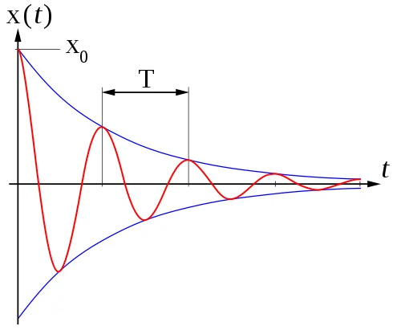
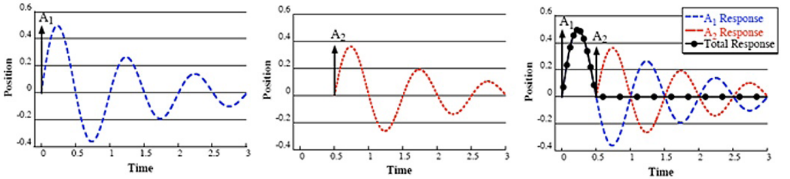

# Allgemeines zur Eingabeshaping und -abstimmung

Da immer mehr Menschen diese Makros verwenden, tauchen Fragen zur Interpretation der Ergebnisse oder zur ordnungsgemäßen Abstimmung/Korrektur des mechanischen Verhaltens einer Maschine auf. Dieses Dokument soll einige Anleitungen zur Interpretation bieten. Beachten Sie, dass es keine universelle Methode gibt: Verschiedene Personen können die Ergebnisse unterschiedlich interpretieren oder andere Meinungen haben. Es ist wichtig zu experimentieren und herauszufinden, was für Ihren eigenen 3D-Drucker am besten funktioniert.

## Verständnis von Ringing

Wenn sich ein 3D-Drucker bewegt, wenden die Motoren eine Kraft an, um den Werkzeugkopf entlang eines präzisen Pfades zu bewegen. Diese Kraft wird von der Motorwelle über das gesamte Bewegungssystem des Druckers auf den Werkzeugkopf übertragen. Wenn der Werkzeugkopf eine scharfe Ecke erreicht und die Richtung ändern muss, möchte seine Trägheit ihn weiter geradeaus bewegen lassen. Die Motoren zwingen den Werkzeugkopf zur Wende, aber die Riemen wirken wie Federn, die es dem Werkzeugkopf erlauben, sich in der senkrechten Richtung zu schwingen. Diese Schwingungen erzeugen sichtbare Artefakte auf den gedruckten Teilen, bekannt als Ringing oder Ghosting.

## Allgemeines zu den Diagrammen

Beim Abstimmen von Input Shaper sollten Sie folgendes beachten:
  1. **Konzentrieren Sie sich auf die Form der Diagramme, nicht auf die genauen Zahlen**. Es kann Unterschiede zwischen Beschleunigungskarten oder sogar Druckern geben, daher gibt es keinen spezifischen "Zielwert". Das bedeutet, dass Sie nicht erwarten sollten, zwischen verschiedenen Druckern gleiche Diagramme zu erhalten, auch wenn sie hinsichtlich Marke, Teilen, Größe und Montage ähnlich sind.
  1. Kleine Unterschiede zwischen aufeinanderfolgenden Testläufen sind normal, da die Qualität und Empfindlichkeit von Beschleunigungssensoren zwischen den Karten variieren kann.
  1. Führen Sie die Tests durch, wenn die Maschine aufgeheizt ist und den Druckbedingungen nahe kommt, da die Temperatur Komponenten wie Riemenzug oder sogar den Rahmen beeinflussen kann, der sich ein wenig ausdehnen kann.
  1. Vermeiden Sie während der Tests das Einschalten der Werkzeugkopflüfter, da diese unnötigen Lärm in die Diagramme bringen und deren Interpretation erschweren. Das bedeutet, dass Sie, obwohl Sie den Drucker aufheizen sollten, auch darauf verzichten sollten, den Heizblock während des Tests zu aktivieren, da dies auch den Heizblocklüfter auslöst. Da jedoch ein defekter Lüfter Vibrationen verursachen kann, können Sie den Test nutzen, um einen unausgeglichenen Lüfter zu diagnostizieren, wie im Abschnitt [Beispiele für Input Shaper-Diagramme](./macros/axis_tuning.md) zu sehen.
  1. Stellen Sie die Genauigkeit Ihrer Beschleunigungsmessungen sicher, indem Sie einen `MEASURE_AXES_NOISE`-Test durchführen und überprüfen, ob das Ergebnis für alle Achsen unter 100 liegt. Wenn dies nicht der Fall ist, überprüfen Sie Ihre Beschleunigungskarte und die Verkabelung, bevor Sie fortfahren.
  1. Die Diagramme können nur Symptome möglicher Probleme auf unterschiedliche Weise zeigen. Diese Symptome können manchmal Ursachen vorschlagen, aber sie identifizieren selten die genauen Probleme genau. Zum Beispiel können Sie zwar diagnostizieren, dass einige Schrauben nicht richtig festgezogen sind, es ist jedoch unwahrscheinlich, dass Sie nur mit diesen Tests herausfinden können, welche genaue Schraube problematisch ist. Sie werden meistens basteln und experimentieren müssen.
  1. Denken Sie schließlich daran, warum Sie diese Tests durchführen: um saubere Drucke zu erhalten. Werden Sie nicht zu obsessiv über perfekte Diagramme, da die letzten Optimierungsschritte wahrscheinlich den geringsten Einfluss auf die gedruckten Teile in Bezug auf Ringing und Ghosting haben.

### Hinweis zum Montagepunkt des Beschleunigungssensors
Eingabeshaping-Algorithmen sind darauf ausgelegt, Resonanzen zu mildern, indem sie eine spezifische Resonanzfrequenz oder einen Bereich um sie herum anvisieren. Beim Einstellen des Filters ist es das **primäre Ziel, die Resonanzfrequenz des Werkzeugkopf- und Riemen-Systems anzusteuern** (siehe [die Theorie dahinter](#theorie-dahinter)), da dies den größten Einfluss auf die Druckqualität hat und die Ursache für Ringing ist.

Die Wahl des Montagepunkts des Beschleunigungssensors ist wichtig. Derzeit gibt es drei Montagestrategien, die jeweils unterschiedliche Vorteile bieten:

| Montagepunkt | Vorteile | Überlegungen |
| --- | --- | --- |
| **Direkt an der Düsenspitze** | Bietet einen umfassenden Überblick über alle Maschinenvibrationen, einschließlich der Hauptresonanz, aber auch des Werkzeugkopfwackelns und der globalen Rahmenbewegungen. Ideal zur Diagnose kinematischer Probleme und zur Fehlerbehebung. | Ergebnis ist rauschreichere Daten, die die endgültige Auswahl des Eingabeshaping-Filters auf Maschinen, die nicht perfekt und/oder nicht vollständig starr sind, erschweren können. |
| **In der Nähe des Schwerpunkts des Werkzeugkopfs** | Bietet hauptsächlich nur einen Blick auf die primären Resonanzfrequenzen des Werkzeugkopfs und der Riemen, was eine präzise Filterauswahl für das Eingabeshaping ermöglicht. Die Daten sind oft sauberer, wobei nur schwere mechanische Probleme oder sehr problematisches Werkzeugkopfwackeln auf den Diagrammen sichtbar sind. | Kann weniger Details zu sekundären Vibrationen liefern (die nur einen geringen Einfluss auf das Ringing haben) und kann weniger effektiv bei der Diagnose nicht verwandter mechanischer Probleme sein. |
| **Integrierter Beschleunigungssensor auf einer CANBus-Platine** | Einfach und effektiv, erfordert keine zusätzliche Installation und ist immer verfügbar. Kann bei der Diagnose von Problemen helfen, die durch Bowdenrohre, Schirmleitungen und Kabelketten verursacht werden. Wenn der Werkzeugkopf sehr starr ist, sind die Messungen denen des Schwerpunkts nahe genug. | Nicht genau genug für eine detaillierte Analyse oder Diagnose mechanischer Probleme aufgrund der Entfernung von der Düsenspitze und potenziellem Rauschen durch angebrachte Komponenten. |

Während Sie sich normalerweise auf das mechanische Teilsystem von Werkzeugkopf/Riemen für die Resonanzminderung konzentrieren sollten (da es den größten Einfluss auf Ringing und Druckqualität hat), sollten Sie die Bedeutung von Messungen an der Düsenspitze für andere Vibrationsquellen nicht übersehen. Tatsächlich, wenn die Ergebnisse der Resonanzanalyse zwischen den Montagepunkten stark variieren, wird empfohlen, die Steifigkeit des Werkzeugkopfs zu verstärken, um Wackeln und Vibrationen zu minimieren. Hier ist eine Strategie, die versucht, mechanische Probleme methodisch anzugehen und dann bei Bedarf die Auswahl von Eingabeshaping-Filtern für den Alltag zu ermöglichen:
  1. **Diagnosephase**: Beginnen Sie mit der Montage an der Düsenspitze, um mechanische Probleme zu identifizieren und zu beheben, um sicherzustellen, dass die Komponenten des Druckers gesund sind und die Montage gut und optimiert ist.
  1. **Filterauswahlphase**: Wenn die Diagramme größtenteils sauber sind, können Sie zu einem Montagepunkt in der Nähe des Schwerpunkts des Werkzeugkopfs übergehen, um sauberere Daten über die Hauptresonanz zu erhalten, die eine genaue Einstellung des Eingabeshaping-Filters erleichtern. Sie können auch den integrierten CANBus-Beschleunigungssensor in Betracht ziehen, insbesondere wenn der Werkzeugkopf besonders starr ist und nur minimal von Wackeln betro

ffen ist.

## Theorie dahinter

### Modellierung des Bewegungssystems
Das Bewegungssystem eines 3D-Druckers kann als Feder-Masse-System beschrieben werden, das am besten als harmonischer Oszillator modelliert wird. Schauen Sie sich [diesen Wikipedia-Artikel](https://en.wikipedia.org/wiki/Harmonic_oscillator) oder [hier](https://beltoforion.de/en/harmonic_oscillator/) für einige Beispiele an. Dieses System hat zwei Schlüsselparameter:

| Ungedämpfte Resonanzfrequenz (natürliche Frequenz) | Dämpfungsverhältnis ζ |
| --- | --- |
| $$\frac{1}{2\pi}\sqrt{\frac{k}{m}}$$ | $$\frac{c}{2}\sqrt{\frac{1}{km}}$$ |
| `k` [N/m]: Federkonstante `m` [g]: bewegte Masse | `c` [N·s/m]: viskoser Dämpfungskoeffizient `k` [N/m]: Federkonstante `m` [g]: bewegte Masse |

Wenn eine schwingende Eingangskraft mit einer Resonanzfrequenz (oder einer Fourier-Komponente davon) auf ein dynamisches System angewendet wird, schwingt das System mit einer höheren Amplitude als wenn dieselbe Kraft bei anderen, nicht-resonanten Frequenzen angewendet wird. Dies wird als Resonanz bezeichnet und kann für einige Systeme gefährlich sein, führt bei unseren Druckern jedoch hauptsächlich zu Vibrationen und Schwingungen des Werkzeugkopfs.

Andererseits ist das Dämpfungsverhältnis (ζ) ein dimensionsloses Maß, das beschreibt, wie Schwingungen in einem System nach einer Störung abklingen. Es kann von unterdämpft (ζ < 1) über kritisch gedämpft (ζ = 1) bis überdämpft (ζ > 1) variieren.

Bei 3D-Druckern ist es recht schwierig, die Federkonstante `k` zu messen und noch schwieriger, den viskosen Dämpfungskoeffizienten `c` zu messen, da diese durch verschiedene Faktoren wie Riemen, Kunststoffteile, Rahmensteifigkeit, Schienen, Reibung, Schmiermittel und Motorsteuerung beeinflusst werden. Darüber hinaus besteht ein 3D-Drucker aus vielen Untersystemen, von denen jedes sein eigenes Verhalten hat. Einige Untersysteme, wie das Werkzeugkopf/Riemen-System, haben einen größeren Einfluss auf Ringing als andere, wie zum Beispiel die Motorwellenresonanz.

### Wie Input Shaping hilft
Die schnelle Bewegung von Maschinen ist ein herausforderndes Steuerungsproblem, da sie oft zu hohen Vibrationsniveaus führt. Daher werden Maschinen typischerweise relativ langsam bewegt. Input Shaping ist eine offene Steuerungsmethode, die höhere Bewegungsgeschwindigkeiten ermöglicht, indem sie Vibrationen begrenzt, die durch den Referenzbefehl induziert werden. Es kann auch die Zuverlässigkeit des StealthChop-Modus von Trinamic-Schrittmotortreibern verbessern.

Es funktioniert, indem ein Befehlssignal erstellt wird, das seine eigene Vibration aufhebt, erreicht durch [Faltung](https://en.wikipedia.org/wiki/Convolution) speziell entwickelter Impulssignale (A2) mit dem ursprünglichen Systemsteuersignal (A1). Das daraus resultierende geformte Signal wird dann verwendet, um das System zu steuern (Gesamtantwort). Um diese Impulse zu entwickeln, werden die ungedämpfte Resonanzfrequenz des Systems und das Dämpfungsverhältnis verwendet.

Klipper misst diese Parameter, indem es den Drucker mit einer Reihe von Eingabebefehlen anregt und das Antwortverhalten mit einem Beschleunigungssensor aufzeichnet. Resonanzen können auf den resultierenden Diagrammen durch große Spitzen identifiziert werden, die ihre Frequenz und Energie anzeigen. Zusätzlich ist das Dämpfungsverhältnis normalerweise schwer zu messen ohne spezielle Ausrüstung, aber diese Skripte geben eine Schätzung, die in den meisten Fällen ausreichen sollte. Es gibt keinen Grund mehr, den Standardwert 0.1 von Klipper zu verwenden!
