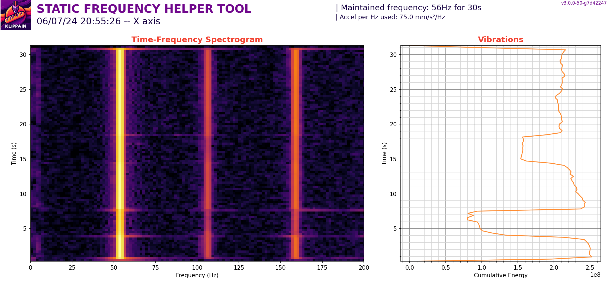

### Idee und Anleitung von Frix_x#0161 (https://github.com/Frix-x) 
### Übersetzt von Fragmon#2722

# Kalibrierungsmakro 4.0

Update 07.07.2024 - Aktualisierungen der Anleitungen

## Beschreibung

Dieses Set von Makros und Kalibrierungstools, welche dir bei der Einrichtung deines Druckers helfen.

## Installation

  > **Deinstallation alter Versionen**:
  >
  > Lösche die `Calibrate.cfg` und wenn vorhanden, den `K-Shake-Tune Ordner` aus deinem Verzeichnis.


  > **Aktualisiere deinen Raspberry**:
  >
  > Folgende Bibliotheken und Anwendungen werden benötigt und normalerweise mithilfe des Installationsskriptes aktualisiert. Es kann jedoch passieren, dass während der Installation Fehler auftreten. Des Weiteren sollte das System mindestens Bullseye oder Bookworm sein. Buster ist veraltet und kann inkompatibilitäten auslösen.
  > GitPython==3.1.41
  > matplotlib==3.8.2
  > numpy==1.26.2
  > scipy==1.11.4
  > PyWavelets==1.6.0


  1. Kopiere die Makrodatei "calibrate_4.0.cfg" direkt in deine eigene Konfiguration.
  2. Stelle sicher, dass die Klipper-Erweiterung 'gcode_shell_command.py' installiert ist.
  Die einfachste Installationsmethode ist die Nutzung des erweiterten Bereichs von KIAUH.\
  [KIAUH installieren](https://www.obico.io/blog/install-klipper-with-kiauh/#install-kiauh-on-your-raspberry-pi)\
  Starte KIAUH -> 4) [Erweitert] -> 8) [G-Code Shell Befehl]
  3. Installiere die Shake-Tune-Python (diese werden in klippy/extras integriert und lassen sich über Befehle später aufrufen
     ```bash
     wget -O - https://raw.githubusercontent.com/Frix-x/klippain-shaketune/main/install.sh | bash
     ```
  5. Füge folgende Konfiguration in deine  `printer.cfg` ein:
     ```
     [shaketune]
     # result_folder: ~/printer_data/config/ShakeTune_results
     #    The folder where the results will be stored. It will be created if it doesn't exist.
     # number_of_results_to_keep: 3
     #    The number of results to keep in the result_folder. The oldest results will
     #    be automatically deleted after each runs.
     # keep_raw_csv: False
     #    If True, the raw CSV files will be kept in the result_folder alongside the
     #    PNG graphs. If False, they will be deleted and only the graphs will be kept.
     # show_macros_in_webui: True
     #    Mainsail and Fluidd doesn't create buttons for "system" macros that are not in the
     #    printer.cfg file. If you want to see the macros in the webui, set this to True.
     # timeout: 300
     #    The maximum time in seconds to let Shake&Tune process the CSV files and generate the graphs.
     ```
  6. Füge folgende Konfiguration in deine `moonraker.conf` ein:
     
    [update_manager Klippain-ShakeTune]
    type: git_repo
    origin: https://github.com/Frix-x/klippain-shaketune.git
    path: ~/klippain_shaketune
    virtualenv: ~/klippy-env
    requirements: requirements.txt
    system_dependencies: system-dependencies.json
    primary_branch: main
    managed_services: klipper

## Makros:
`FLOW_MULTIPLIER_CALIBRATION`: Bestimmt den optimalen Extrusionsfaktor. Dieser kann im Slicer gespeichert werden.

`COMPUTE_FLOW_MULTIPLIER`: Wird verwendet, um den optimalen Extrusionsfaktor zu berechnen.

`PRESSURE_ADVANCE_CALIBRATION`: Bestimmt das optimale PA. Kann im Slicer gespeichert werden.

## Shake&Tune-Funktionen

| Shake&Tune-Befehl | Beispielgrafiken |
|:------|:-------:|
|[`AXES_MAP_CALIBRATION`](./macros/axes_map_calibration.md)<br /><br />Überprüft, ob Ihr Beschleunigungssensor korrekt funktioniert und findet automatisch den `axes_map`-Parameter von Klipper | [](./macros/axes_map_calibration.md) |
|[`COMPARE_BELTS_RESPONSES`](./macros/compare_belts_responses.md)<br /><br />Erstellt ein Differenzdiagramm für Riemenresonanzen, um die relativen Riemenspannungen und das Verhalten der Riemenpfade bei einem CoreXY- oder CoreXZ-Drucker zu überprüfen | [](./macros/compare_belts_responses.md) |
|[`AXES_SHAPER_CALIBRATION`](./macros/axes_shaper_calibrations.md)<br /><br />Erstellt die üblichen Eingabeshaper-Diagramme, um die Eingabeshaper-Filter von Klipper zu optimieren und Ringing/Ghosting zu reduzieren | [](./macros/axes_shaper_calibrations.md) |
|[`CREATE_VIBRATIONS_PROFILE`](./macros/create_vibrations_profile.md)<br /><br />Misst die globalen Maschinenvibrationen in Abhängigkeit von der Richtung und Geschwindigkeit des Werkzeugkopfes, um problematische Bereiche zu finden, in denen der Drucker stärkeren VFAs ausgesetzt sein könnte, um Ihre Slicer-Geschwindigkeitsprofile und TMC-Treiberparameter zu optimieren | [](./macros/create_vibrations_profile.md) |
|[`EXCITATE_AXIS_AT_FREQ`](./macros/excitate_axis_at_freq.md)<br /><br />Hält eine spezifische Erregungsfrequenz aufrecht, nützlich, um Parasitenpeaks zu untersuchen und herauszufinden, was resoniert | [](./macros/excitate_axis_at_freq.md) |

## Resonanztest-Arbeitsablauf

Ein standardmäßiger Abstimmungsablauf könnte folgendermaßen aussehen:


## Ergänzende Ressourcen

  - [Beitrag von Sineos](https://klipper.discourse.group/t/interpreting-the-input-shaper-graphs/9879) in der Klipper-Wissensdatenbank
